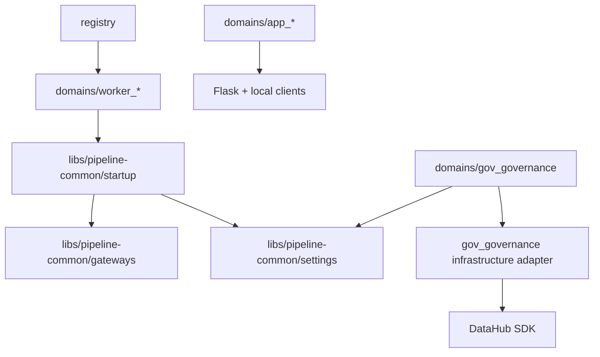
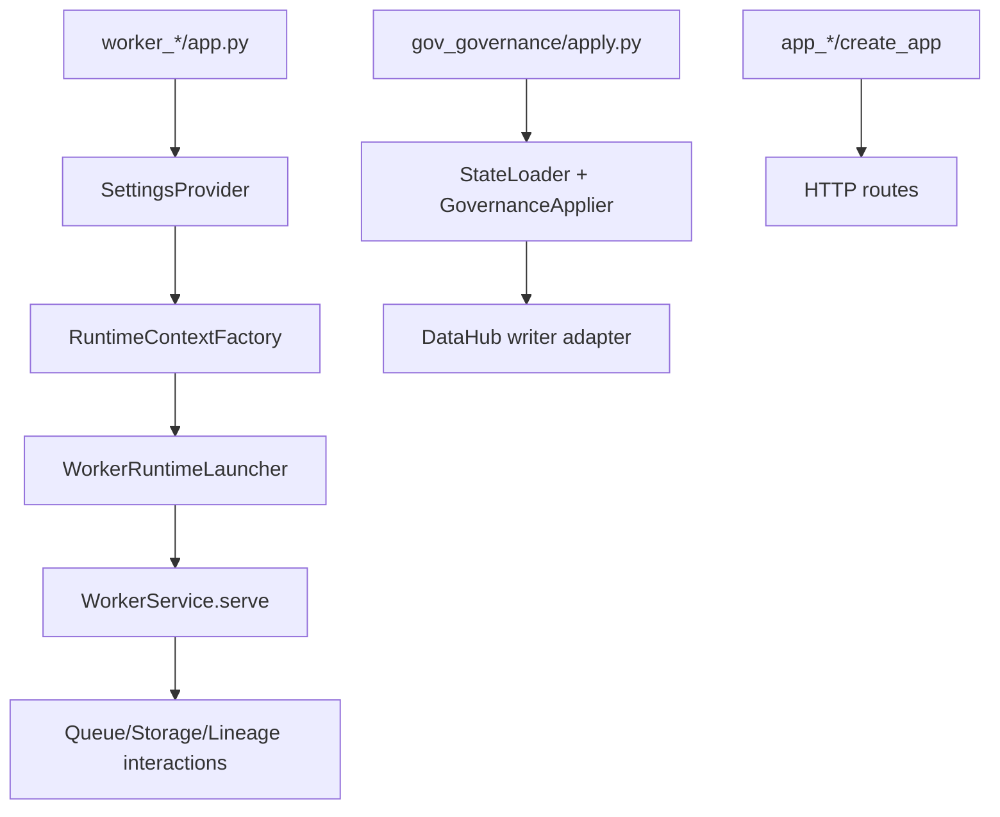

# 1. Purpose

This document describes the current repository architecture at onboarding depth.

Problem it solves:
- New contributors need a practical map of runtime paths, module boundaries, and extension points across the monorepo.

Why it exists:
- Consolidate architecture understanding from code structure and dependency direction.
- Clarify how `domains/`, `libs/`, and governance/app paths fit together.

What it does:
- Documents repository-level layering and runtime flows.
- Identifies architectural boundaries and constraints.
- Highlights known technical debt and likely evolution areas.

What it does not do:
- It is not a feature spec or requirements catalog.
- It does not replace subsystem-specific architecture docs.
- It does not define deployment runbooks.

Repository boundaries:
- Deployable processes live in `domains/`.
- Shared runtime libraries live in `libs/`.
- Architecture and standards guidance lives in `docs/`.

# 2. High-Level Responsibilities

Core responsibilities of repository architecture:
- Separate deployable units from shared libraries.
- Standardize worker startup and gateway usage.
- Support governance metadata-as-code apply flow.
- Support lightweight app domains for retrieval/query use cases.
- Define DEV/PROD tooling portability expectations for core platform capabilities.
- Define and maintain repository-level OSS license governance guardrails.

Non-responsibilities:
- No monolithic process orchestration in one runtime package.
- No strict single architectural style across every domain.

Separation of concerns:
- Worker runtime path: `domains/worker_*` + `libs/pipeline-common`.
- Governance path: `domains/gov_governance`.
- App path: `domains/app_*`.
- Local infra path: `domains/infra_*` + `stack.sh`.

# 3. Architectural Overview

Overall design:
- Multi-domain monorepo with shared runtime core (`pipeline_common`) and multiple executable domains.

Layering (observed in code):
- Composition roots: domain entrypoints (`app.py`, `apply.py`).
- Startup wiring: `pipeline_common.startup` for workers.
- Infrastructure adapters: `pipeline_common.gateways`.
- Configuration adapter: `pipeline_common.settings`.
- Domain services/processors: worker/app/governance local modules.

Patterns used:
- Composition Root: each executable domain has explicit startup entrypoint.
- Dependency Injection: startup launcher/factories inject runtime dependencies.
- Factory: runtime context and gateway factories.
- Ports & Adapters (partial): lineage gateway and governance catalog writer port.
- Registry: job-key registry used by worker composition roots.

Why chosen:
- Keep runtime paths explicit and testable.
- Allow independent evolution of worker/app/governance domains.
- Reuse startup and gateway mechanics across workers.

# 4. Module Structure

Repository structure (architecture-relevant):
- `domains/`: deployable worker/app/governance/infra units.
- `libs/pipeline-common/`: shared worker/runtime abstractions and adapters.
- `registry/`: DataHub job-key registry used by worker entrypoints.
- `docs/`: architecture and standards documentation.
- `stack.sh` + domain compose files: local stack orchestration.

Architecture document index (central references):
- `docs/ARCHITECTURE.md` (this file)
- `domains/docs/ARCHITECTURE.md`
- `domains/gov_governance/docs/ARCHITECTURE.md`
- `domains/worker_scan/docs/ARCHITECTURE.md`
- `domains/worker_parse_document/docs/ARCHITECTURE.md`
- `domains/worker_chunk_text/docs/ARCHITECTURE.md`
- `domains/worker_embed_chunks/docs/ARCHITECTURE.md`
- `domains/worker_index_weaviate/docs/ARCHITECTURE.md`
- `domains/worker_manifest/docs/ARCHITECTURE.md`
- `domains/worker_metrics/docs/ARCHITECTURE.md`
- `domains/app_rag_api/docs/ARCHITECTURE.md`
- `domains/app_vector_ui/docs/ARCHITECTURE.md`
- `libs/pipeline-common/src/pipeline_common/startup/docs/ARCHITECTURE.md`
- `libs/pipeline-common/src/pipeline_common/settings/docs/ARCHITECTURE.md`
- `libs/pipeline-common/src/pipeline_common/gateways/docs/ARCHITECTURE.md`
- `libs/pipeline-common/src/pipeline_common/gateways/lineage/docs/ARCHITECTURE.md`
- `registry/docs/ARCHITECTURE.md`
- `tooling/ops/docs/ARCHITECTURE.md`
- `tooling/python_env/docs/ARCHITECTURE.md`
- `tooling/ci/docs/ARCHITECTURE.md`

What belongs where:
- Shared runtime concerns: `libs/pipeline-common`.
- Process-specific composition and business logic: `domains/*`.
- Governance definitions: `domains/gov_governance/definitions`.
- Cross-system architecture docs: `docs/`.

Dependency flow:
- `domains/*` may depend on `libs/pipeline-common` and `registry`.
- `libs/*` must not depend on `domains/*`.
- Driver SDKs are concentrated in gateway/infrastructure adapters.

# 5. Runtime Flow (Golden Path)

Primary golden path (worker runtime):
1. Worker entrypoint loads capability-scoped settings.
2. Worker runtime factory builds lineage/storage/queue gateways and parsed job properties.
3. Launcher extracts worker config, builds service, and calls `serve()`.
4. Worker service processes queue payloads and uses gateways.
5. Lineage events are emitted to DataHub during run lifecycle.

Secondary paths:
- Governance apply path: load definitions -> resolve refs -> apply managers -> persist via DataHub adapter.
- App path: Flask app factory -> routes/clients -> HTTP request handling.

Shutdown/termination behavior:
- Service/process lifecycle is owned by each domain runtime and container/process manager.

# 6. Key Abstractions

`SettingsProvider` (`pipeline_common.settings`)
- Represents: capability-scoped env loader.
- Why exists: keeps env parsing out of entrypoint and service logic.
- Depends on: gateway settings loaders.
- Depended on by: workers and governance apply entrypoints.
- Safe extension: add capabilities explicitly in request/bundle contract.

`RuntimeContextFactory` (`pipeline_common.startup`)
- Represents: worker runtime dependency assembler.
- Why exists: centralize gateway construction and job-properties parsing.
- Depends on: settings bundle, gateway factories, DataHub job key.
- Depended on by: worker entrypoints.
- Safe extension: keep worker-specific logic out of shared factory.

`WorkerRuntimeLauncher` (`pipeline_common.startup`)
- Represents: standard worker startup orchestrator.
- Why exists: enforce consistent startup sequence.
- Depends on: runtime factory + worker extractor/factory implementations.
- Depended on by: all worker domains.
- Safe extension: preserve startup step ordering.

`LineageRuntimeGateway` and `DataHubRuntimeLineage` (`pipeline_common.gateways.lineage`)
- Represents: runtime lineage emission abstraction and DataHub adapter.
- Why exists: emit run lifecycle lineage with centralized DataHub semantics.
- Depends on: DataHub graph client, schema classes, URN utilities.
- Depended on by: worker runtime services.
- Safe extension: preserve lifecycle and MCP ordering invariants.

`GovernanceApplier` + `GovernanceCatalogWriterPort` (`domains/gov_governance`)
- Represents: governance orchestration + persistence boundary.
- Why exists: apply YAML definitions in deterministic order with adapter isolation.
- Depends on: state loader, manager contexts, writer adapter.
- Depended on by: governance CLI entrypoint.
- Safe extension: update manager contexts, port, and adapter together for new entity types.

# 7. Extension Points

Where new features should be added:
- Shared worker runtime capability: `libs/pipeline-common`.
- New worker process: `domains/worker_<name>` using existing startup pattern.
- Governance entity model/apply flow: `domains/gov_governance` managers + port + adapter.
- App endpoint/service behavior: `domains/app_*` modules.

Where integrations should plug in:
- External runtime integration for workers: gateway adapter + factory + settings.
- Governance backend behavior: writer adapter implementation.
- New infrastructure tools/services: add only with explicit DEV and PROD usage profiles.
- New infrastructure tools/services: add only with explicit license classification and approval.

How to avoid boundary violations:
- Keep dependency direction from domains toward libs, not inverse.
- Keep SDK-specific calls concentrated in adapters.
- Keep composition roots shallow and explicit.

# 8. Known Issues & Technical Debt

Issue: mixed strictness of architectural layering across subsystems.
- Why problem: workers are highly standardized; app/governance paths are more pragmatic and inconsistent.
- Direction: improve consistency where complexity and reuse justify it.

Issue: constructor side effects in selected startup/adapters.
- Why problem: object creation may trigger IO, reducing predictability in tests/startup diagnostics.
- Direction: shift to explicit init/connect steps where practical.

Issue: DataHub specificity in lineage/governance paths.
- Why problem: tighter coupling increases migration cost to alternate metadata backends.
- Direction: preserve and extend existing port boundaries where valuable.

Issue: architecture docs are distributed across multiple subsystem files.
- Why problem: onboarding requires navigation across several docs.
- Direction: keep cross-links current and ensure subsystem docs stay synchronized with code.

Issue: no formal DEV->PROD tooling parity matrix is currently documented.
- Why problem: cloud/prod migration risk increases when local tooling assumptions are not explicitly mapped to production-capable equivalents.
- Direction: maintain a parity matrix for queue/storage/vector/lineage/observability/LLM dependencies.

Initial parity matrix template:

| Capability | DEV Tooling (Current) | PROD Tooling (Target) | Interface Boundary | Parity Status | Gaps / Notes |
| --- | --- | --- | --- | --- | --- |
| Queue | RabbitMQ (compose) | TBD | `StageQueue` | Not started | Define ack/retry/ordering parity requirements. |
| Object Storage | MinIO/S3-compatible (compose) | TBD | `ObjectStorageGateway` | Not started | Define bucket policy, IAM, lifecycle, and eventing parity. |
| Vector Store | Weaviate (compose) | TBD | Worker/service Weaviate clients | In progress | Define schema/index/versioning and query-behavior parity. |
| Lineage Backend | DataHub (compose) | TBD | `LineageRuntimeGateway` + governance writer port | In progress | Define ingestion throughput and UI navigation parity targets. |
| Observability | Local logs + counters | TBD | Logging/tracing adapters | Not started | Define metrics/traces/logs contract and retention parity. |
| LLM Runtime | Local Ollama | TBD | LLM client adapters | Not started | Define model/API compatibility, latency, and cost constraints. |

Issue: no explicit repository-level OSS license policy is currently documented.
- Why problem: license risk can be discovered late during production hardening and procurement/legal review.
- Direction: maintain an approved-license policy and enforce license checks in CI.

Issue: public portfolio redistribution can unintentionally include restrictive third-party licensing obligations.
- Why problem: publishing source and especially bundled container artifacts can trigger obligations (copyleft/source-available) that are often missed in personal projects.
- Direction: keep third-party license inventory current, document portfolio-safe publishing constraints, and avoid distributing bundled artifacts for restricted components.

# 9. Future Roadmap / Planned Enhancements

Confirmed roadmap:
- Establish consistent unit-test and functional-test coverage standards across modules.
- Establish a standardized linting baseline and enforcement flow across the repository.
- Define and maintain a DEV/PROD tooling parity matrix for core platform services.
- Add license governance checks (approved-license policy + dependency license audit in CI).
- Add lightweight portfolio-publishing checks/docs to prevent accidental redistribution risk.
- Add migration-readiness checks to validate behavior parity between local and cloud/prod profiles.

### Allowed (validated permissive OSS licenses)
- **Weaviate DB**: BSD-3-Clause (permissive; self-host and cloud options).

Audit source links are maintained in a separate compliance evidence document:
- `docs/compliance/OSS_LICENSE_EVIDENCE.md`

### Repository-level OSS license policy

Policy intent:
- Ensure all OSS dependencies are safe for commercial DEV and PROD use.
- Prevent late-stage legal/procurement blockers during cloud migration.

Default allowed license families:
- Apache-2.0
- MIT
- BSD-2-Clause / BSD-3-Clause
- ISC

Conditionally allowed (requires explicit legal/security review record):
- MPL-2.0
- EPL-2.0
- LGPL variants

Not allowed for new dependencies by default:
- GPL variants (GPL-2.0, GPL-3.0)
- AGPL variants
- SSPL and other copyleft/network copyleft licenses that can impose broader distribution obligations
- Custom or unknown licenses without approved legal review

Policy requirements for new dependencies:
1. License must be identified and documented before merge.
2. Dependency must be added to an approved dependency/license inventory.
3. Any conditional license must include explicit approval reference (legal/security decision record).
4. Dependency updates must be re-evaluated when license metadata changes.

CI enforcement expectations:
- Run automated license scan on dependency manifests/lockfiles.
- Fail CI for denied/unknown licenses unless explicit allow-override is recorded.
- Publish license scan artifact for auditability.

# 10. Anti-Patterns / What Not To Do

- Do not create reverse dependencies from `libs/` into `domains/`.
- Do not bypass shared startup abstractions for workers without clear justification.
- Do not scatter direct SDK calls through worker services when gateway adapters already exist.
- Do not put non-documentation runtime code under `docs/`.
- Do not treat architecture docs as static; update them with significant structural changes.
- Do not adopt infrastructure tooling without a defined DEV and PROD usage profile.
- Do not introduce new OSS dependencies without explicit license review and approval.

# 11. Glossary

- Composition Root: entrypoint module that wires concrete dependencies.
- Gateway: infrastructure adapter around an external service/SDK.
- Worker Runtime: queue-driven long-running process pipeline.
- Governance Apply: CLI process that upserts governance metadata definitions.
- Capability-Scoped Settings: explicit requested settings subset loaded from environment.
