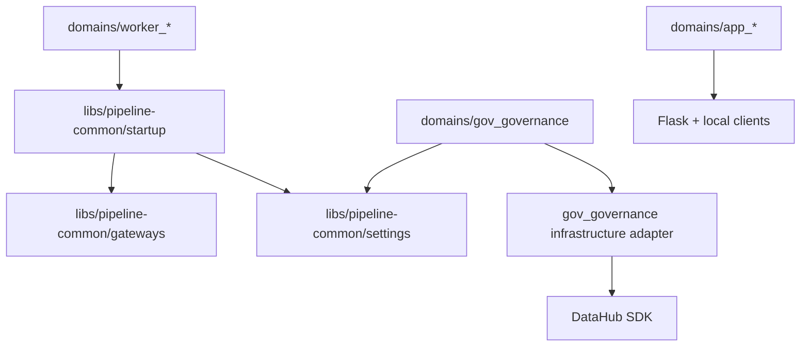
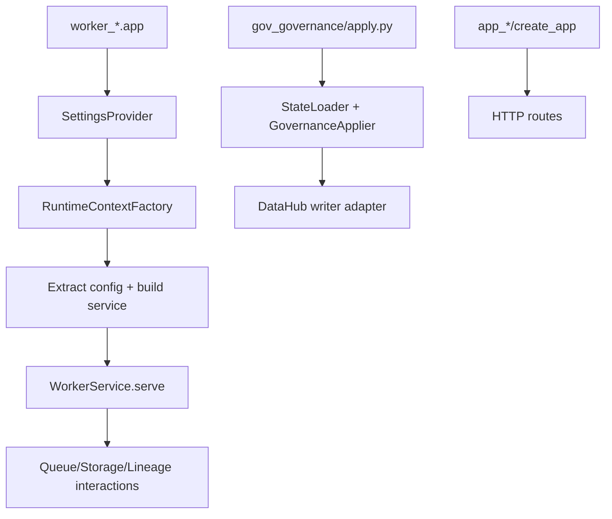

# 1. Purpose

This document describes the current repository architecture at onboarding depth.

Problem it solves:
- New contributors need a practical map of runtime paths, module boundaries, and extension points across the monorepo.

Why it exists:
- Consolidate architecture understanding from code structure and dependency direction.
- Clarify how `domains/`, `libs/`, and governance/app paths fit together.

What it does:
- Documents repository-level layering and runtime flows.
- Identifies architectural boundaries and constraints.
- Highlights known technical debt and likely evolution areas.

What it does not do:
- It is not a feature spec or requirements catalog.
- It does not replace subsystem-specific architecture docs.
- It does not define deployment runbooks.

Repository boundaries:
- Deployable processes live in `domains/`.
- Shared runtime libraries live in `libs/`.
- Architecture and standards guidance lives in `docs/`.

# 2. High-Level Responsibilities

Core responsibilities of repository architecture:
- Separate deployable units from shared libraries.
- Standardize worker startup and gateway usage.
- Support governance metadata-as-code apply flow.
- Support lightweight app domains for retrieval/query use cases.

Non-responsibilities:
- No monolithic process orchestration in one runtime package.
- No strict single architectural style across every domain.

Separation of concerns:
- Worker runtime path: `domains/worker_*` + `libs/pipeline-common`.
- Governance path: `domains/gov_governance`.
- App path: `domains/app_*`.
- Agent platform path: `libs/agent/platform` + `domains/agent_api` + `libs/agent/core`.
- Local infra path: `domains/infra_*` + `stack.sh`.
- RAG app split: `domains/ai_ui` is the UI/front door and `domains/agent_api` is the retrieval/LLM backend.

# 3. Architectural Overview

Overall design:
- Multi-domain monorepo with shared runtime core (`pipeline_common`) and multiple executable domains.
- The agent-platform MVP adds a second shared runtime core (`ai_infra`) for supervised capability execution and a thin API domain that reuses the same service graph.
- `libs/agent/platform` now also owns reusable RAG backend logic: LLM access, Weaviate retrieval, and retrieval-grounded response orchestration.

Layering (observed in code):
- Composition roots: package entrypoints (`<package>.app`, `apply.py`).
- Startup wiring: `pipeline_common.startup` for workers.
- Infrastructure adapters: `pipeline_common.gateways`.
- Configuration adapter: `pipeline_common.settings`.
- Domain services/processors: worker/app/governance local modules.

Patterns used:
- Composition Root: each executable domain has explicit startup entrypoint.
- Dependency Injection: startup factories and worker-local composition inject runtime dependencies.
- Factory: runtime context and gateway factories.
- Ports & Adapters (partial): lineage gateway and governance catalog writer port.
- Registry: job-key registry used by worker composition roots.
- Dataclass Serialization: contract models expose explicit full-object and payload dictionary views.

Why chosen:
- Keep runtime paths explicit and testable.
- Allow independent evolution of worker/app/governance domains.
- Reuse startup and gateway mechanics across workers.

# 4. Module Structure

Repository structure (architecture-relevant):
- `domains/`: deployable worker/app/governance/infra units.
- `domains/agent_api/`: HTTP wrapper around the `agent_platform` service graph and the active RAG backend surface.
- `domains/ai_ui/`: Flask UI/front-door that forwards prompt execution to `agent_api`.
- `libs/pipeline-common/`: shared worker/runtime abstractions and adapters.
- `libs/agent/core/`: shared contracts, protocols, policies, registries, and orchestration services for the agent platform.
- `libs/agent/platform/`: reusable agent runtime package with CLI, local adapters, packaged config assets, and shared RAG backend services.
- `docs/`: architecture and standards documentation.
- `stack.sh` + domain compose files: local stack orchestration.

Architecture document index (central references):
- `docs/ARCHITECTURE.md` (this file)
- `docs/patterns/chunk-embedding-provenance-registry.md`
- `docs/patterns/dataclass-serialization.md`
- `domains/docs/ARCHITECTURE.md`
- `domains/gov_governance/docs/ARCHITECTURE.md`
- `domains/worker_scan/docs/ARCHITECTURE.md`
- `domains/worker_parse_document/docs/ARCHITECTURE.md`
- `domains/worker_chunk_text/docs/ARCHITECTURE.md`
- `domains/worker_embed_chunks/docs/ARCHITECTURE.md`
- `domains/worker_index_weaviate/docs/ARCHITECTURE.md`
- `domains/ai_ui/docs/ARCHITECTURE.md`
- `domains/agent_api/docs/ARCHITECTURE.md`
- `domains/app_vector_ui/docs/ARCHITECTURE.md`
- `libs/agent/core/`
- `libs/agent/platform/docs/ARCHITECTURE.md`
- `libs/pipeline-common/src/pipeline_common/startup/docs/ARCHITECTURE.md`
- `libs/pipeline-common/src/pipeline_common/settings/docs/ARCHITECTURE.md`
- `libs/pipeline-common/src/pipeline_common/gateways/docs/ARCHITECTURE.md`
- `libs/pipeline-common/src/pipeline_common/gateways/lineage/docs/ARCHITECTURE.md`
- `registry/docs/ARCHITECTURE.md`
- `tooling/ops/docs/ARCHITECTURE.md`
- `tooling/python_env/docs/ARCHITECTURE.md`
- `tooling/ci/docs/ARCHITECTURE.md`

What belongs where:
- Shared runtime concerns: `libs/pipeline-common`.
- Process-specific composition and business logic: `domains/*`.
- Governance definitions: `domains/gov_governance/definitions`.
- Cross-system architecture docs: `docs/`.

Editor note:
- [`/.vscode/settings.json`](/home/sultan/repos/governed-rag-foundation/.vscode/settings.json) uses per-domain Pylance execution environments only to keep click-through and "Go to Definition" working.
- This is still useful because the repo has many separate Python source roots, even though the worker and agent projects now use namespaced package roots instead of generic top-level modules.

Dependency flow:
- `domains/*` may depend on reusable `libs/*` packages.
- `domains/agent_api` may depend on `libs/agent/platform` and `libs/agent/core`.
- `libs/*` must not depend on `domains/*`.
- Driver SDKs are concentrated in gateway/infrastructure adapters.

# 5. Runtime Flow (Golden Path)

Primary golden path (worker runtime):
1. Worker entrypoint loads capability-scoped settings.
2. Worker runtime factory builds lineage/storage/queue gateways, and parsed job properties.
3. Worker entrypoint extracts worker config, builds service, and calls `serve()`.
4. Worker service processes queue payloads and uses gateways.
5. Queue consumers settle messages explicitly via `ack()` / `nack(requeue=...)` after each processing attempt.
6. Lineage events are emitted to DataHub during run lifecycle.

Secondary paths:
- Governance apply path: load definitions -> resolve refs -> apply managers -> persist via DataHub adapter.
- App path: Flask app factory -> routes/clients -> HTTP request handling.

Shutdown/termination behavior:
- Service/process lifecycle is owned by each domain runtime and container/process manager.

# 6. Key Abstractions

`SettingsProvider` (`pipeline_common.settings`)
- Represents: capability-scoped env loader.
- Why exists: keeps env parsing out of entrypoint and service logic.
- Depends on: gateway settings loaders.
- Depended on by: workers and governance apply entrypoints.
- Safe extension: add capabilities explicitly in request/bundle contract.

`RuntimeContextFactory` (`pipeline_common.startup`)
- Represents: worker runtime dependency assembler.
- Why exists: centralize gateway construction, and job-properties parsing.
- Depends on: settings bundle, gateway factories, DataHub job key.
- Depended on by: worker entrypoints.
- Safe extension: keep worker-specific logic out of shared factory.

`StageQueue` and `ConsumedMessage` (`pipeline_common.gateways.queue`)
- Represents: AMQP queue adapter plus explicit message settlement handle.
- Why exists: prevent eager-ack message loss during longer processing windows.
- Depends on: broker connection/channel lifecycle and worker-defined failure policy.
- Depended on by: queue-driven workers (`parse/chunk/embed/index`).
- Safe extension: preserve one-time settlement semantics and explicit worker-side `ack`/`nack` decisions.

`LineageRuntimeGateway` and `DataHubRuntimeLineage` (`pipeline_common.gateways.lineage`)
- Represents: runtime lineage emission abstraction and DataHub adapter.
- Why exists: emit run lifecycle lineage with centralized DataHub semantics.
- Depends on: DataHub graph client, schema classes, URN utilities.
- Depended on by: worker runtime services.
- Safe extension: preserve lifecycle and MCP ordering invariants.

`GovernanceApplier` + `GovernanceCatalogWriterPort` (`domains/gov_governance`)
- Represents: governance orchestration + persistence boundary.
- Why exists: apply YAML definitions in deterministic order with adapter isolation.
- Depends on: state loader, manager contexts, writer adapter.
- Depended on by: governance CLI entrypoint.
- Safe extension: update manager contexts, port, and adapter together for new entity types.

# 7. Extension Points

Where new features should be added:
- Shared worker runtime capability: `libs/pipeline-common`.
- New worker process: `domains/worker_<name>` using existing startup pattern.
- Governance entity model/apply flow: `domains/gov_governance` managers + port + adapter.
- App endpoint/service behavior: `domains/app_*` modules.

Where integrations should plug in:
- External runtime integration for workers: gateway adapter + factory + settings.
- Governance backend behavior: writer adapter implementation.

How to avoid boundary violations:
- Keep dependency direction from domains toward libs, not inverse.
- Keep SDK-specific calls concentrated in adapters.
- Keep composition roots shallow and explicit.

# 8. Known Issues & Technical Debt

Issue: mixed strictness of architectural layering across subsystems.
- Why problem: workers are highly standardized; app/governance paths are more pragmatic and inconsistent.
- Direction: improve consistency where complexity and reuse justify it.

Issue: constructor side effects in selected startup/adapters.
- Why problem: object creation may trigger IO, reducing predictability in tests/startup diagnostics.
- Direction: shift to explicit init/connect steps where practical.

Issue: DataHub specificity in lineage/governance paths.
- Why problem: tighter coupling increases migration cost to alternate metadata backends.
- Direction: preserve and extend existing port boundaries where valuable.

Issue: architecture docs are distributed across multiple subsystem files.
- Why problem: onboarding requires navigation across several docs.
- Direction: keep cross-links current and ensure subsystem docs stay synchronized with code.

# 9. Future Roadmap / Planned Enhancements

Confirmed roadmap:
- Establish consistent unit-test and functional-test coverage standards across modules.
- Establish a standardized linting baseline and enforcement flow across the repository.

# 10. Anti-Patterns / What Not To Do

- Do not create reverse dependencies from `libs/` into `domains/`.
- Do not bypass shared startup contracts for workers without clear justification.
- Do not scatter direct SDK calls through worker services when gateway adapters already exist.
- Do not put non-documentation runtime code under `docs/`.
- Do not treat architecture docs as static; update them with significant structural changes.

# 11. Glossary

- Composition Root: entrypoint module that wires concrete dependencies.
- Gateway: infrastructure adapter around an external service/SDK.
- Worker Runtime: queue-driven long-running process pipeline.
- Governance Apply: CLI process that upserts governance metadata definitions.
- Capability-Scoped Settings: explicit requested settings subset loaded from environment.
