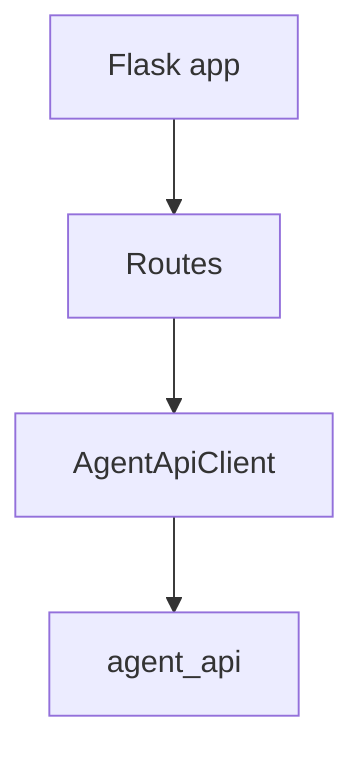
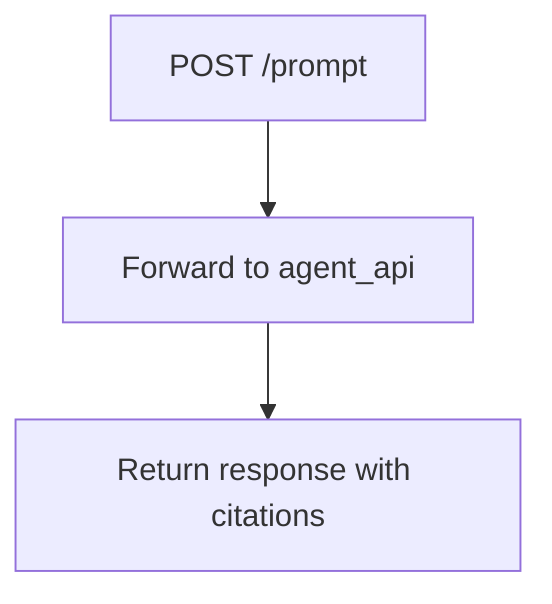

# 1. Purpose

ai_ui is a Flask UI service for the retrieval-grounded application flow.

It does:
- Serve the UI and HTTP front door for the RAG application.
- Forward prompt payloads to `agent_api`.
- Return backend responses to clients.

It does not:
- Execute worker pipeline processing.
- Manage governance apply workflows.

# 2. High-Level Responsibilities

- HTTP routing and UI serving.
- Delegation to `agent_api`.

# 3. Architectural Overview

- app.py: app factory and composition root.
- routes.py: endpoint registration.
- ../../libs/agent/settings/src/agent_settings/settings: runtime settings loader.
- ai_infra.AgentApiClient: backend HTTP adapter from the shared library.

# 4. Module Structure

- src/ai_ui/app.py
- src/ai_ui/routes.py
- .env.example
- ../../libs/agent/settings/src/agent_settings/settings
- ../../libs/agent/core/src/ai_infra/agent_api_client.py

# 5. Runtime Flow (Golden Path)

1. App starts and loads settings.
2. POST /prompt forwards the payload to `agent_api`.
3. Backend returns assistant response and citations.
4. API returns that response to the caller.

# 6. Key Abstractions

- AgentApiClient

# 7. Extension Points

- Add endpoints in routes.py.
- Extend backend request handling in `libs/agent/core/src/ai_infra/agent_api_client.py`.

# 8. Known Issues & Technical Debt

- Synchronous backend HTTP call in request path.
- No built-in auth layer.

# 9. Future Roadmap / Planned Enhancements

Confirmed roadmap:
- None explicitly documented in this module.

# 10. Anti-Patterns / What Not To Do

- Do not reintroduce retrieval or LLM orchestration into this service.
- Do not bypass backend error mapping before downstream calls.

# 11. Glossary

- Grounded prompt: LLM input augmented with retrieved source context.
