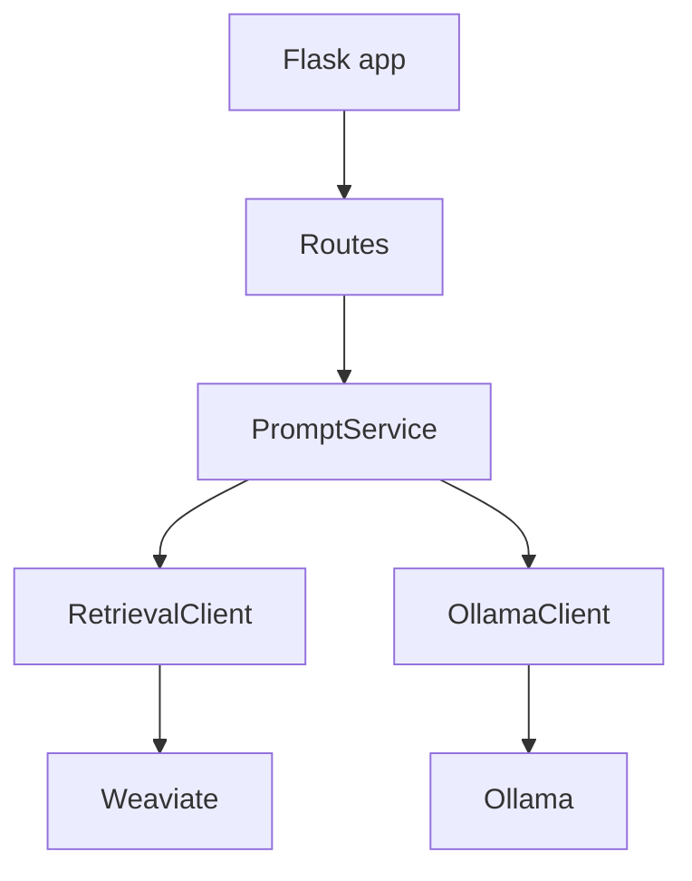
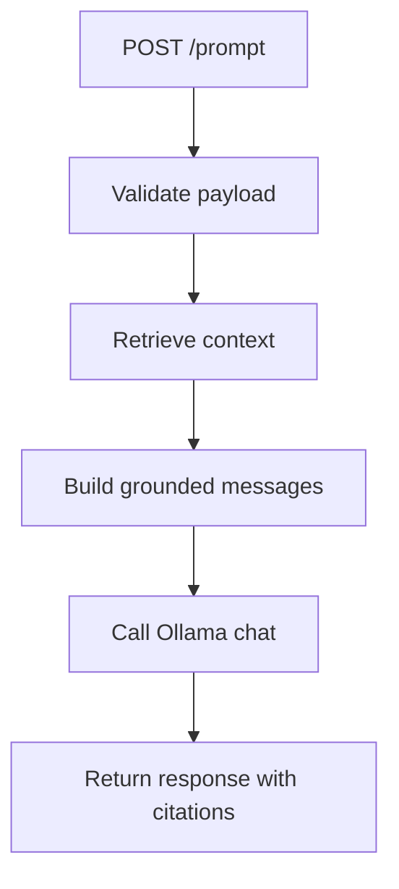

# 1. Purpose

app_rag_api is a Flask service for retrieval-grounded prompt answering.

It does:
- Validate prompt request payloads.
- Retrieve relevant chunk context from Weaviate.
- Call Ollama for chat response generation.
- Return response with citations.

It does not:
- Execute worker pipeline processing.
- Manage governance apply workflows.

# 2. High-Level Responsibilities

- HTTP routing and payload validation.
- Prompt orchestration with retrieved context.
- LLM and retrieval client integration.

# 3. Architectural Overview

- app.py: app factory and composition root.
- routes.py: endpoint registration.
- services/prompt_service.py: orchestration service.
- retrieval_client.py and llm_client.py: external adapters.

# 4. Module Structure

- src/rag_api/app.py
- src/rag_api/routes.py
- src/rag_api/config.py
- src/rag_api/services/prompt_service.py
- src/rag_api/retrieval_client.py
- src/rag_api/llm_client.py

# 5. Runtime Flow (Golden Path)

1. App starts and loads settings.
2. POST /prompt validates message payload.
3. PromptService retrieves matching chunks.
4. PromptService builds grounded prompt messages.
5. OllamaClient sends chat request.
6. API returns assistant response and citations.

# 6. Key Abstractions

- PromptService
- RetrievalClient
- OllamaClient

# 7. Extension Points

- Add endpoints in routes.py.
- Extend retrieval behavior in retrieval_client.py.
- Extend response policies in prompt_service.py.

# 8. Known Issues & Technical Debt

- Synchronous downstream HTTP calls in request path.
- No built-in auth layer.

# 9. Future Roadmap / Planned Enhancements

Confirmed roadmap:
- None explicitly documented in this module.

# 10. Anti-Patterns / What Not To Do

- Do not place orchestration logic directly in route handlers.
- Do not bypass payload validation before downstream calls.

# 11. Glossary

- Grounded prompt: LLM input augmented with retrieved source context.
