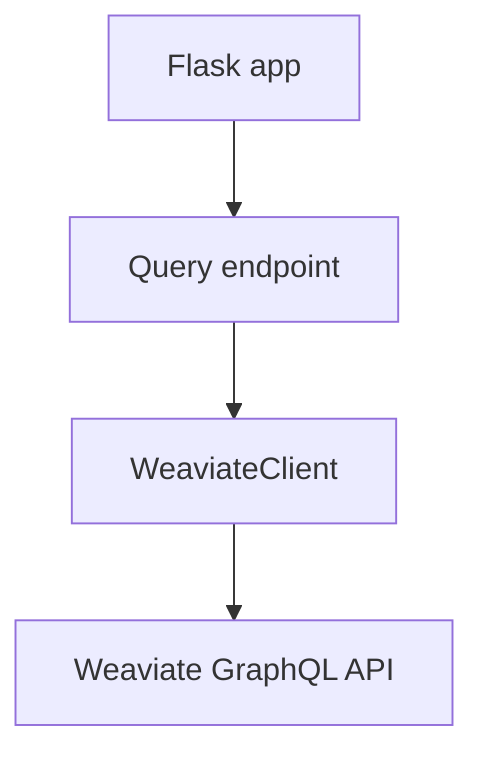
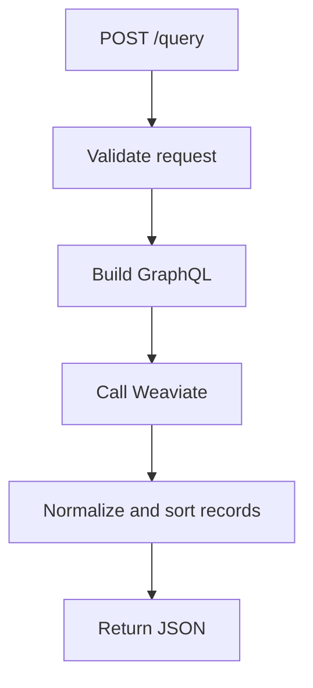

# 1. Purpose

app_vector_ui is a Flask UI/API for querying DocumentChunk records in Weaviate.

# 2. High-Level Responsibilities

- Serve UI and health endpoints.
- Validate query payload fields.
- Execute GraphQL chunk queries.
- Return query records and generated query text.

# 3. Architectural Overview

- app.py: app and endpoint composition.
- weaviate_client.py: GraphQL query builder and HTTP client.
- config.py: environment settings.

# 4. Module Structure

- src/vector_ui/app.py
- src/vector_ui/config.py
- src/vector_ui/weaviate_client.py
- src/vector_ui/templates/ui.html

# 5. Runtime Flow (Golden Path)

1. Service starts and loads Weaviate settings.
2. Client posts query payload.
3. Handler validates phrase/doc/limit/sort fields.
4. WeaviateClient executes GraphQL query.
5. Handler applies optional sort and returns results.

# 6. Key Abstractions

- create_app
- WeaviateClient

# 7. Extension Points

- Add endpoint behavior in app.py.
- Add query capabilities in weaviate_client.py.

# 8. Known Issues & Technical Debt

- No auth/access control in module.
- Query assembly is string-based.

# 9. Future Roadmap / Planned Enhancements

Confirmed roadmap:
- None explicitly documented in this module.

# 10. Anti-Patterns / What Not To Do

- Do not bypass request validation.
- Do not place raw HTTP logic directly in route handler methods.

# 11. Glossary

- DocumentChunk: indexed chunk object class in Weaviate.
