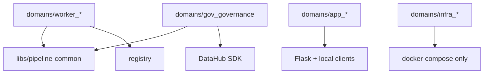
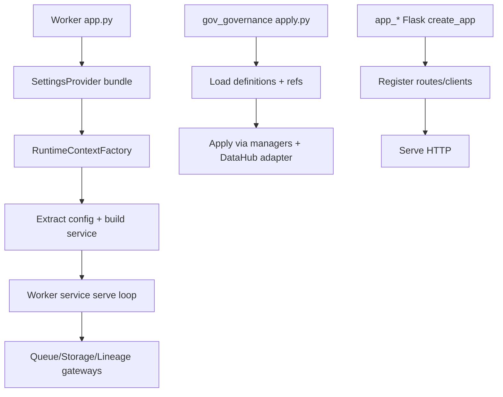

# 1. Purpose

`domains/` contains deployable units for this repository.

Problem it solves:
- Organize independently runnable processes by deployment boundary.

Why it exists:
- Separate pipeline workers, app services, governance tooling, and infrastructure stacks.

What it does:
- Hosts worker runtime processes (`worker_*`).
- Hosts user-facing app processes (`ai_ui`, `app_vector_ui`).
- Hosts governance apply domain (`gov_governance`).
- Hosts infrastructure compose domains (`infra_*`).

What it does not do:
- It does not define shared runtime libraries (those are in `libs/`).
- It does not centralize all architecture rules (see top-level `docs/`).
- Infra domains do not implement Python runtime business logic.

Boundaries:
- `domains/*` may depend on `libs/pipeline-common`.
- `libs/*` must not depend on `domains/*`.

# 2. High-Level Responsibilities

Core responsibilities:
- Provide process-level composition roots and executable runtime packages.
- Keep domain-local business logic and startup wiring together.
- Package deployment-specific runtime dependencies (Dockerfiles, compose files, pyproject configs).

Non-responsibilities:
- No shared utility ownership for cross-domain runtime concerns.
- No global orchestration of all domains at once beyond external stack scripts.

Separation of concerns by subdomain:
- `worker_*`: queue-driven pipeline workers.
- `app_*`: HTTP app services.
- `gov_governance`: governance metadata apply CLI.
- `infra_*`: local infrastructure deployment descriptors.

# 3. Architectural Overview

Overall design:
- Multi-process monorepo with independent domain packages.
- Workers follow a common startup pattern using `pipeline_common.startup`.
- Apps are lightweight Flask-based services.
- Governance is a CLI orchestration path with manager-based apply flow.

Layering patterns observed:
- Composition Root: each domain has explicit entrypoint (`app.py` or `apply.py`).
- Dependency Injection: worker entrypoints compose extractor/factory/runtime context explicitly.
- Factory: worker startup uses service and runtime factories.
- Ports & Adapters (partial): governance writer port, lineage runtime gateway port.

Why chosen:
- Optimize for independent deployability.
- Keep worker startup consistent while allowing worker-specific processing logic.
- Keep app and governance flows pragmatic and explicit.

# 4. Module Structure

Top-level structure under `domains/`:
- `worker_scan`, `worker_parse_document`, `worker_chunk_text`, `worker_embed_chunks`, `worker_index_weaviate`
- `ai_ui`, `app_vector_ui`
- `gov_governance`
- `infra_lineage`, `infra_llm`, `infra_portainer`, `infra_queue`, `infra_storage`, `infra_vector`

What belongs where:
- New worker pipeline stage: `domains/worker_<stage>/`.
- New HTTP service: `domains/app_<name>/`.
- Governance apply features: `domains/gov_governance/`.
- Local infra compose stack: `domains/infra_<name>/`.

Dependency flow:
- Worker domains depend on `pipeline_common` and `registry`.
- App domains typically depend on local app modules and external HTTP/vector clients.
- Governance domain depends on `pipeline_common.settings` and DataHub SDK.

# 5. Runtime Flow (Golden Path)

Primary runtime path (workers):
1. Worker `src/app.py` loads settings with `SettingsProvider`.
2. Worker creates `RuntimeContextFactory` with DataHub job key from `registry`.
3. Startup builds gateways and parsed job properties.
4. Worker entrypoint uses a worker-specific config extractor and service factory.
5. Service is built and `serve()` starts long-running processing loop.
6. Service interacts with queue/storage/lineage gateways.

Alternate runtime paths:
- Governance path: `domains/gov_governance/src/apply.py` loads definitions and applies DataHub updates.
- App path: Flask app factory creates clients/routes and serves HTTP.

Shutdown/termination behavior:
- Owned by each domain process implementation and runtime container/process manager.

# 6. Key Abstractions

Worker domain `app.py`
- Represents: composition root for one worker process.
- Why exists: wires shared startup components and worker-specific collaborators.
- Depends on: `pipeline_common.settings`, `pipeline_common.startup`, worker-local startup/service modules, `registry`.
- Depended on by: container/runtime command entrypoint.
- Safe extension: keep file focused on composition; move business logic to services.

Worker `startup/config_extractor.py`
- Represents: worker config parser.
- Why exists: convert generic `job_properties` into typed worker config contract.
- Depends on: worker contract models.
- Depended on by: worker composition root.
- Safe extension: keep parsing deterministic and explicit.

Worker `startup/service_factory.py`
- Represents: worker service graph builder.
- Why exists: isolate worker dependency assembly.
- Depends on: runtime context and worker config.
- Depended on by: worker composition root.
- Safe extension: avoid leaking wiring logic into worker services.

Worker `services/*.py`
- Represents: runtime business loop.
- Why exists: process payloads and move artifacts between stages.
- Depends on: injected gateways and worker config.
- Depended on by: composition root.
- Safe extension: preserve clear boundaries between business logic and infrastructure calls.

Governance `apply.py` + `GovernanceApplier`
- Represents: governance apply composition and orchestration path.
- Why exists: apply definitions to DataHub in deterministic order.
- Depends on: state loader, manager contexts, writer port/adapter.
- Depended on by: governance CLI execution.
- Safe extension: keep apply ordering explicit when adding new entity types.

# 7. Extension Points

Where to add new features:
- New worker stage: add new `domains/worker_<name>` package using existing startup pattern.
- New governance entity type: extend `gov_governance` state loader + managers + writer port.
- New app endpoint/service: add under corresponding `app_*` domain module.

How integrations should plug in:
- Worker external integration: usually through `pipeline_common.gateways` and injected runtime context.
- Governance integration: through writer port and infrastructure adapter.

How to avoid architectural boundary violations:
- Do not add shared cross-domain runtime utilities inside `domains/`; place them in `libs/`.
- Do not import worker domain modules into shared libs.
- Do not place domain business logic into entrypoint files.

# 8. Known Issues & Technical Debt

Issue: architectural consistency varies by domain type.
- Why problem: workers are strongly standardized while app domains are more ad hoc.
- Direction: adopt shared conventions for app domains only if repeated complexity appears.

Issue: some startup and adapter constructors perform I/O.
- Why problem: side effects during object construction can make startup behavior harder to reason about.
- Direction: consider explicit connect/initialize phases where needed.

Issue: governance domain has pragmatic coupling to DataHub SDK concepts.
- Why problem: makes backend portability lower and broadens change impact.
- Direction: keep port/adapter boundary strict in new governance changes.

Issue: infra domains are separate but not reflected in runtime code architecture docs.
- Why problem: onboarding can miss distinction between deploy/runtime code and compose-only domains.
- Direction: maintain explicit notes that `infra_*` are deployment configuration domains.

# 9. Future Roadmap / Planned Enhancements

Confirmed roadmap:
- Expand unit and functional test coverage conventions across worker/app/governance domains.
- Align domain-level linting practices with a shared repository lint baseline.

# 10. Anti-Patterns / What Not To Do

- Do not place shared libraries in `domains/`; use `libs/`.
- Do not bypass worker startup contracts with per-worker one-off bootstrap flows unless justified.
- Do not put long business logic in `app.py`/`apply.py` entrypoints.
- Do not introduce reverse dependency from `libs/` into `domains/`.
- Do not treat `infra_*` directories as runtime Python modules.

# 11. Glossary

- Domain: independently deployable unit in this repo.
- Worker Domain: queue-driven pipeline process with a long-running serve loop.
- App Domain: HTTP service process.
- Governance Domain: CLI process that applies governance definitions to DataHub.
- Infra Domain: compose/deployment configuration package for local infrastructure.
