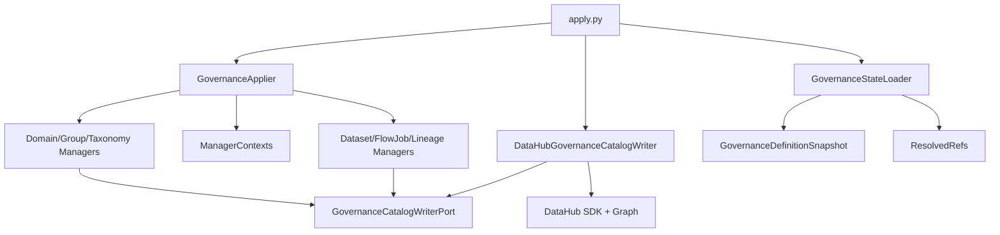
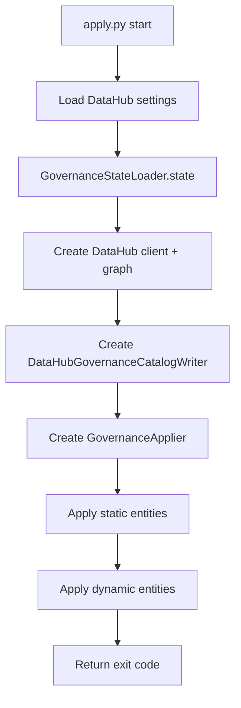

# 1. Purpose

`domains/gov_governance` applies governance metadata-as-code into DataHub.

Problem it solves:
- Governance entities (domains, groups, taxonomy, datasets, flows/jobs, lineage contracts) need deterministic, repeatable application from versioned YAML definitions.

Why it exists:
- Keep governance model as source-controlled definitions.
- Provide one CLI-driven apply path for catalog updates.

What it does:
- Discovers and parses governance YAML definition files.
- Builds in-memory governance snapshot and resolved ID->URN references.
- Applies entities in dependency-safe order through manager classes.
- Persists to DataHub via one writer adapter implementing a port.

What it does not do:
- It does not provide a long-running worker runtime.
- It does not expose an HTTP API.
- It does not perform transactional rollback across apply stages.

Boundaries:
- Upstream: CLI entrypoint `src/apply.py`.
- Downstream: DataHub SDK and Graph APIs through infrastructure adapter.

# 2. High-Level Responsibilities

Core responsibilities:
- Definition discovery/loading (`state_loader`).
- Orchestration and ordering (`orchestration/governance_applier.py`).
- Entity-specific apply behavior (`entities/*/manager.py`).
- Catalog persistence via port/adapter boundary (`entities/shared/ports.py`, `infrastructure/datahub/catalog_writer.py`).

Non-responsibilities:
- No business workflow beyond governance apply sequence.
- No runtime queue/storage processing.
- No schema migration framework for DataHub metadata.

Separation of concerns:
- Definitions state and refs: `state_loader`.
- Application orchestration: `GovernanceApplier`.
- Entity transformation/application: managers + typed definitions.
- External persistence: DataHub writer adapter.

# 3. Architectural Overview

Overall design:
- CLI composition root + manager orchestration + DataHub adapter.
- Managers operate over typed definitions and resolved reference maps.
- Writer port isolates manager logic from concrete DataHub SDK operations.

Layering:
- Startup/composition: `src/apply.py`.
- State loading: `src/state_loader/*`.
- Application orchestration: `src/orchestration/*`.
- Entity application layer: `src/entities/*`.
- Infrastructure adapter: `src/infrastructure/datahub/*`.

Patterns used:
- Composition Root: `apply.py` wires settings, state, writer, and applier.
- Ports & Adapters: `GovernanceCatalogWriterPort` + `DataHubGovernanceCatalogWriter`.
- Manager pattern: one manager per entity family.
- Factory-like typed model conversion: `*.from_mapping()` in definitions.

Why chosen:
- Keeps apply ordering explicit.
- Provides testable seam between orchestration/managers and DataHub persistence.
- Supports incremental growth of governance entity types.

# 4. Module Structure

Relevant structure:
- `src/apply.py`: CLI entrypoint.
- `src/state_loader/governance_definitions_state.py`: definition discovery, pipeline assembly, refs resolution.
- `src/orchestration/governance_applier.py`: apply orchestration and manager context split.
- `src/entities/shared/definitions.py`: typed definition dataclasses.
- `src/entities/shared/context.py`: per-manager context contracts + resolved refs.
- `src/entities/shared/ports.py`: writer port.
- `src/entities/*/manager.py`: domain/group/taxonomy/dataset/flow-job/lineage apply logic.
- `src/infrastructure/datahub/catalog_writer.py`: DataHub adapter implementation.
- `definitions/**/*.yaml`: source-of-truth governance definitions.

What belongs where:
- New entity parsing/typing: `state_loader` + `entities/shared/definitions.py`.
- New entity apply behavior: `entities/<entity>/manager.py`.
- New persistence behavior: writer port + infrastructure adapter.

Dependency flow:
- Orchestration depends on entity managers and shared contracts.
- Managers depend on writer port and context maps.
- Adapter depends on DataHub SDK classes.

# 5. Runtime Flow (Golden Path)

Golden path for `python src/apply.py`:
1. Load DataHub settings via `SettingsProvider(SettingsRequest(datahub=True))`.
2. Build `GovernanceStateLoader(env)` and compute `.state`.
3. State loader discovers YAML files and builds:
   - standalone payloads (domains/groups/tags/terms/datasets)
   - relational payloads (flow/jobs/lineage_contract) assembled into pipelines
   - resolved reference maps (`ResolvedRefs`)
4. Create DataHub client and graph objects.
5. Construct `DataHubGovernanceCatalogWriter`.
6. Construct `GovernanceApplier` and run `apply()`.
7. Applier executes deterministic order:
   - static: domains -> groups -> taxonomy
   - dynamic: datasets -> flow/jobs -> lineage contracts
8. Writer adapter upserts entities to DataHub.

Shutdown/termination behavior:
- `apply.py` uses `with DataHubGraph(...)` to scope graph client lifecycle per run.
- Process exits with applier return code.

# 6. Key Abstractions

`GovernanceStateLoader`
- Represents: governance definitions loader and resolver.
- Why exists: produce consistent runtime state from YAML definitions.
- Depends on: filesystem helpers, YAML reader, DataHub URN classes.
- Depended on by: `apply.py`.
- Safe extension: keep output contracts (`GovernanceState`, `ResolvedRefs`) stable.

`GovernanceApplier`
- Represents: orchestration of manager execution order.
- Why exists: enforce deterministic dependency-safe apply sequence.
- Depends on: `GovernanceState`, writer port, manager contexts.
- Depended on by: `apply.py`.
- Safe extension: add new manager phase with explicit ordering.

`GovernanceCatalogWriterPort`
- Represents: application-side persistence contract.
- Why exists: decouple managers from DataHub SDK implementation details.
- Depends on: method signatures only.
- Depended on by: managers and applier path.
- Safe extension: extend port and adapter together; avoid partial implementation drift.

`DataHubGovernanceCatalogWriter`
- Represents: DataHub SDK/graph adapter implementing writer port.
- Why exists: concentrate DataHub-specific payload/upsert logic.
- Depends on: DataHub SDK entities and MCP wrappers.
- Depended on by: `apply.py` composition root via port.
- Safe extension: preserve existing upsert semantics for current entity types.

Entity Managers (`DomainManager`, `GroupManager`, `TaxonomyManager`, `DatasetManager`, `FlowJobManager`, `LineageContractManager`)
- Represents: entity-family apply units.
- Why exists: isolate per-entity mapping and writer calls.
- Depends on: typed definitions + context maps + writer port.
- Depended on by: `GovernanceApplier`.
- Safe extension: maintain deterministic iteration and explicit map resolution.

# 7. Extension Points

Where to add new features:
- New definition type:
  1. Extend `DefinitionType` and discovery logic.
  2. Add typed definition model.
  3. Add manager context if needed.
  4. Add manager and apply-phase wiring.
  5. Extend writer port and adapter.

Where integrations should plug in:
- New catalog backend: implement `GovernanceCatalogWriterPort` in new adapter module.
- Keep manager logic writing only through port methods.

How to avoid boundary violations:
- Do not import DataHub SDK directly into manager classes.
- Do not bypass `GovernanceApplier` ordering from ad hoc scripts.
- Do not embed filesystem discovery logic into managers.

# 8. Known Issues & Technical Debt

Issue: loader performs work during construction.
- Why problem: `GovernanceStateLoader.__init__` executes `_load()` immediately, coupling construction with IO/validation.
- Direction: consider explicit `load()` call for clearer lifecycle and testing ergonomics.

Issue: two-phase job upsert duplicates job writes.
- Why problem: jobs are upserted once in `FlowJobManager` and again in `LineageContractManager`.
- Direction: keep current explicit strategy unless performance/consistency issues appear; if needed, consolidate into single pass with clear fallback behavior.

Issue: map-key resolution errors are hard failures.
- Why problem: missing domain/group/tag/term/dataset IDs raise key errors during apply.
- Direction: add preflight validation reporting missing references before write phase.

Issue: DataHub-specific URN construction appears in loader and adapter layers.
- Why problem: backend portability is limited.
- Direction: retain current design unless multi-backend requirement emerges.

# 9. Future Roadmap / Planned Enhancements

Confirmed roadmap:
- None explicitly documented in this domain.

# 10. Anti-Patterns / What Not To Do

- Do not perform DataHub SDK operations directly from managers; use writer port.
- Do not change apply ordering without understanding dependency impact.
- Do not bypass typed `from_mapping()` models with raw dict usage in managers.
- Do not mutate resolved reference maps during apply execution.
- Do not add new definition categories without extending discovery and orchestration together.

# 11. Glossary

- Governance Definition Snapshot: aggregated in-memory representation of YAML definitions.
- Resolved Refs: ID->URN maps used during manager apply steps.
- Pipeline Definition: flow + jobs + lineage-contract grouping used for dynamic apply phase.
- Writer Port: application contract for catalog persistence operations.
- Two-Phase Job Upsert: first upsert jobs without lineage, then re-upsert with inlets/outlets.
