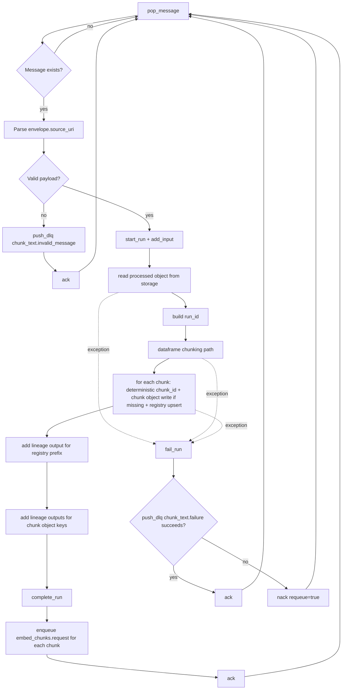
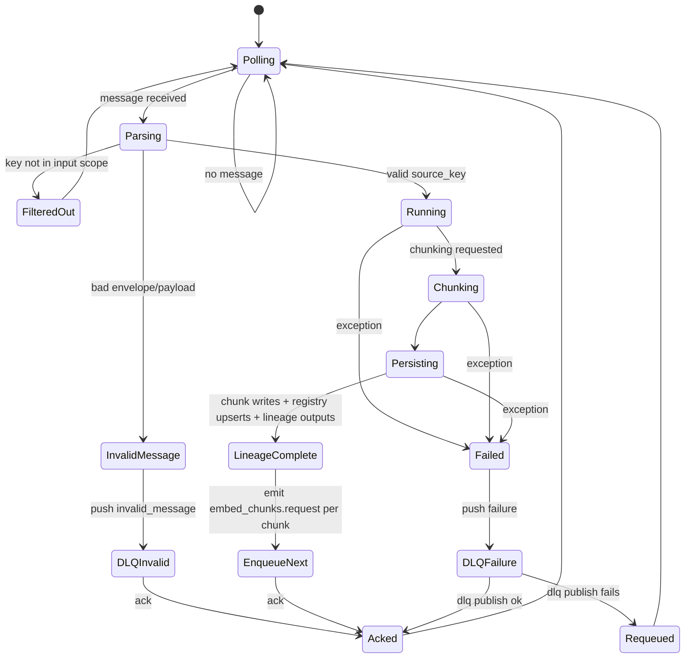
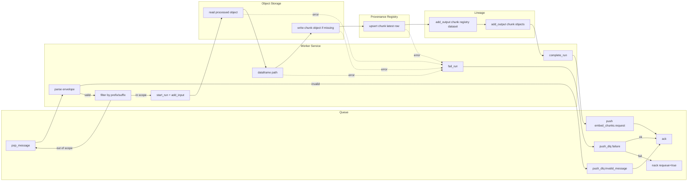

# worker_chunk_text Workflow Variants

This file gives the same current runtime behavior in four different styles so you can choose the one you prefer.

---

## A) Flowchart Style

---

## B) State Diagram Style

---

## C) Swimlane Activity Style

---

## D) Plain Step-by-Step (No Diagram)

1. Worker loops forever and calls `stage_queue.pop_message()`.
2. If message is missing, loop continues.
3. Worker parses envelope and extracts `payload.source_uri`.
4. If payload is invalid:
   - publishes `chunk_text.invalid_message` to DLQ,
   - `ack()` the original message,
   - continue loop.
5. For valid chunk request:
   - starts lineage run,
   - adds lineage input for source object.
6. Reads processed JSON object from storage.
7. Generates `run_id`.
8. Processing path:
   - Dataframe path.
9. For each chunk produced:
   - computes deterministic `chunk_id` from provenance fields,
   - writes chunk artifact if object key does not already exist,
   - upserts chunk registry latest row at `07_metadata/provenance/chunking/latest/<chunk_id>.json`.
10. Adds lineage output for registry dataset prefix.
11. Adds lineage outputs for each chunk artifact key.
12. Completes lineage run.
13. Enqueues one `embed_chunks.request` per chunk object.
14. `ack()` the consumed message.
15. On any processing exception:
   - marks lineage run as failed,
   - publishes `chunk_text.failure` to DLQ,
   - if DLQ publish succeeds -> `ack()`, otherwise -> `nack(requeue=true)`.

---

## Notes

- This reflects current code behavior in `src/service/worker_chunk_text_service.py` and `src/service/chunk_text_processor.py`.
- The four views above are equivalent descriptions of the same runtime flow.
