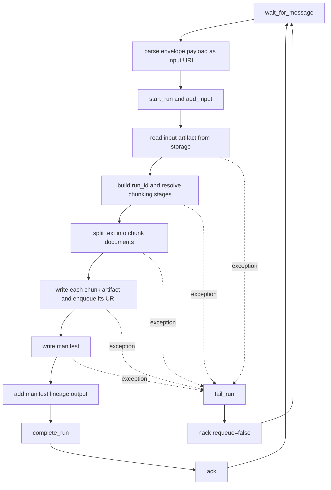
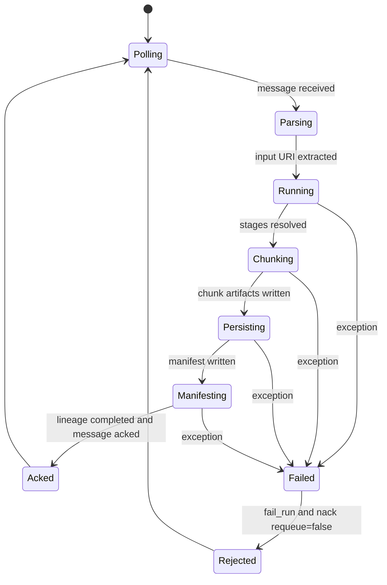
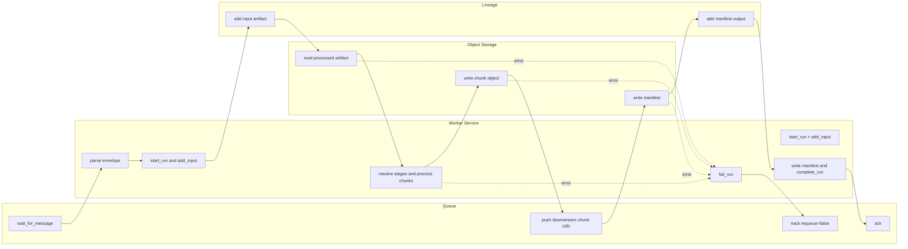

# worker_chunk_text Workflow Variants

This file gives the same current runtime behavior in four different styles so you can choose the one you prefer.

---

## A) Flowchart Style

---

## B) State Diagram Style

---

## C) Swimlane Activity Style

---

## D) Plain Step-by-Step (No Diagram)

1. Worker loops forever and calls `stage_queue.pop_message()`.
2. Worker parses the queue envelope and treats the payload as an input artifact URI.
3. Worker starts a lineage run and adds the input URI as an input dataset.
4. Worker reads the upstream stage artifact from object storage.
5. Worker generates a run ID from the source URI.
6. Worker resolves chunking stages from `root_doc_metadata.source_type`.
7. Worker applies the configured LangChain splitters to the source text.
8. For each chunk produced:
   - computes a deterministic `chunk_id`,
   - writes one chunk artifact object,
   - publishes the chunk URI to the downstream queue.
9. Worker writes a manifest for the process result.
10. Worker adds the manifest URI as a lineage output and completes the run.
11. Worker `ack()`s the consumed message.
12. On any processing exception:
   - marks the lineage run as failed,
   - `nack(requeue=false)`s the original message.

---

## Notes

- This reflects current code behavior in `src/service/worker_chunk_text_service.py` and `src/service/chunk_text_processor.py`.
- This reflects current code behavior in `src/service/worker_chunking_service.py` and `src/processor/chunk_text.py`.
- The four views above are equivalent descriptions of the same runtime flow.
