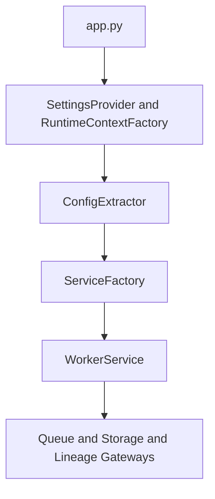
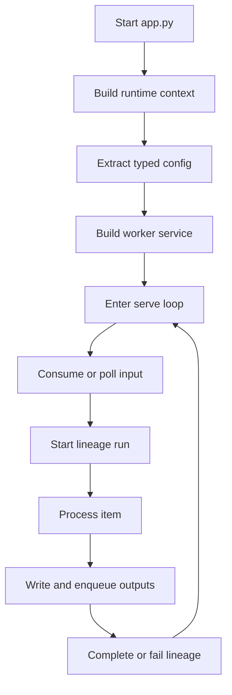

# 1. Purpose

worker_embed_chunks is a queue-driven stage worker in the pipeline.

Problem it solves:
- Converts chunk payloads into embedding artifacts and forwards indexing work.

What it does:
- Uses shared startup/runtime assembly from pipeline_common.
- Runs a long-lived processing loop.
- Emits runtime lineage per processed unit.

What it does not do:
- It does not orchestrate the full pipeline.
- It does not own shared infrastructure configuration logic.

Boundary:
- Input: Embed queue messages and chunk objects
- Output: Embedding objects and index queue messages

# 2. High-Level Responsibilities

Core responsibilities:
- Parse stage config from resolved job properties.
- Consume work, transform/process, publish outputs.
- Emit success/failure lineage transitions.

Non-responsibilities:
- Cross-worker coordination.
- Governance metadata apply.

# 3. Architectural Overview

Design:
- Composition root in src/app.py.
- Startup extension points in src/startup/config_extractor.py and src/startup/service_factory.py.
- Processing logic in src/services.
- Embedding-vector compute path uses local deterministic execution.

Patterns:
- Composition Root.
- Dependency Injection via WorkerRuntimeContext.
- Factory-based service graph assembly.
- Long-running WorkerService serve loop.

# 4. Module Structure

- src/app.py
- src/contracts/contracts.py
- src/startup/config_extractor.py
- src/startup/service_factory.py
- src/services/*

Dependency direction:
- Worker depends on pipeline_common and registry.
- Shared libraries do not depend on worker domain code.

# 5. Runtime Flow (Golden Path)

1. app.py builds settings bundle and runtime context.
2. config_extractor builds typed worker config.
3. service_factory builds processing service.
4. service enters infinite serve loop.
5. item lifecycle: consume input -> start lineage -> process -> produce output -> complete or fail lineage.
6. queue settlement policy:
   - valid + success: `ack()`
   - invalid payload: publish `embed_chunks.invalid_message` to DLQ, then `ack()`
   - processing failure: publish `embed_chunks.failure` to DLQ, then `ack()`
   - if failure DLQ publish fails: `nack(requeue=True)`

Shutdown behavior:
- No explicit in-module shutdown orchestration.
- Process lifecycle is owned by container/runtime supervisor.

# 6. Key Abstractions

- ConfigExtractor: maps job properties to typed worker config.
- ServiceFactory: composes service dependencies.
- WorkerService: owns runtime loop and per-item processing path.
- LineageRuntimeGateway: emits runtime run and IO events.

# 7. Extension Points

- Add stage config fields in contracts and extractor.
- Add/adjust processing behavior in services.
- Keep runtime dependency composition changes in startup/service_factory.py.

# 8. Known Issues & Technical Debt

- Infinite loops rely on external process control.
- Per-item errors are mostly logged and processing continues.
- Startup-time side effects can occur in composed dependencies.

# 9. Future Roadmap / Planned Enhancements

Confirmed roadmap:
- None explicitly documented in this module.

# 10. Anti-Patterns / What Not To Do

- Do not move stage business logic into app.py.
- Do not bypass typed config extraction with ad hoc dict reads in service code.
- Do not instantiate shared gateways inside per-item hot path methods.

# 11. Glossary

- Runtime context: injected shared gateways and resolved job properties.
- Lineage run: one DataProcessInstance execution lifecycle.
