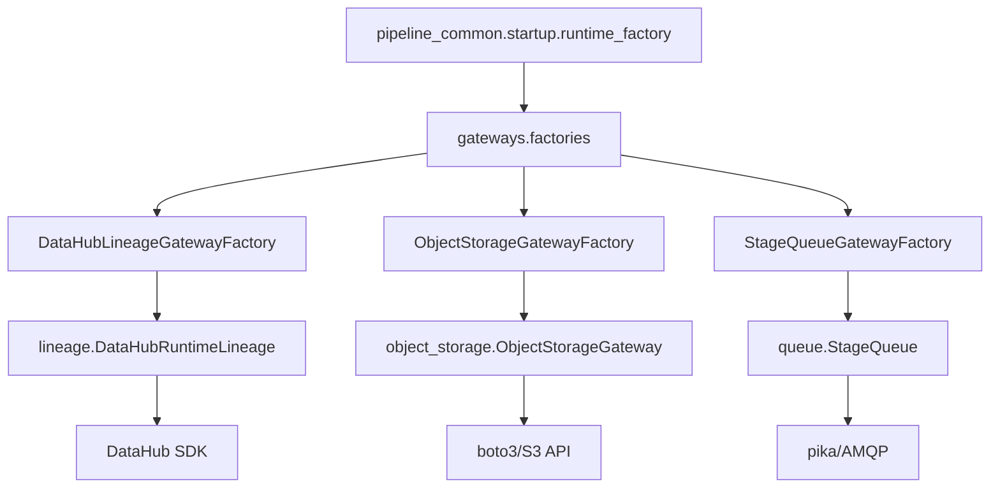
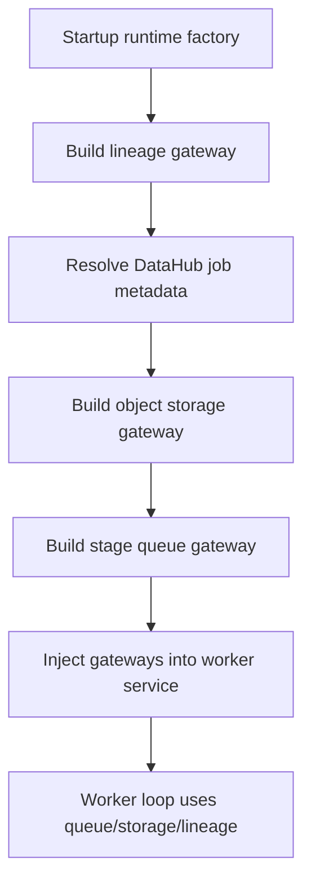

# 1. Purpose

`pipeline_common.gateways` provides infrastructure adapters used by worker runtime.

Problem it solves:
- Worker services need stable interfaces for external systems (DataHub, object storage, queue) without embedding SDK details.

Why it exists:
- Isolate driver-specific code (`datahub`, `boto3`, `pika`) behind worker-facing APIs.
- Keep external protocol concerns out of worker business logic.

What it does:
- Exposes concrete gateways for lineage, object storage, and queue operations.
- Provides factory classes to build configured gateway instances.
- Includes lightweight observability counters utility.

What it does not do:
- It does not implement worker domain processing rules.
- It does not own worker startup sequencing (handled in `pipeline_common.startup`).
- It does not provide a fully vendor-neutral abstraction across all gateways.

Boundaries:
- Upstream: startup runtime factory and worker services.
- Downstream: DataHub, S3-compatible storage, AMQP broker, and SDK clients.

# 2. High-Level Responsibilities

Core responsibilities:
- Encapsulate external connectivity and SDK invocation.
- Provide worker-facing methods for queue/storage/lineage runtime operations.
- Centralize gateway object creation in `gateways/factories`.

Non-responsibilities:
- No orchestration of worker startup lifecycle.
- No long-term persistence beyond external systems themselves.
- No end-to-end pipeline state machine ownership.

Separation of concerns:
- `lineage/`: DataHub runtime lineage gateway.
- `object_storage/`: object storage facade + S3 implementation.
- `queue/`: AMQP stage queue facade.
- `factories/`: gateway constructors from settings.
- `observability/`: simple counters object.

# 3. Architectural Overview

Overall design:
- Adapter/facade pattern per external dependency.
- Factory classes compose concrete gateways from typed settings.
- Startup layer consumes factories and injects gateways into worker services.

Layering:
- Contracts/ports: protocol types (for example lineage runtime port, object storage client protocol).
- Adapter implementations: concrete infrastructure wrappers.
- Factory layer: dependency construction from runtime settings.

Patterns used:
- Ports & Adapters: lineage exposes `LineageRuntimeGateway`; object storage client is protocol-backed.
- Facade: `ObjectStorageGateway`, `StageQueue`, and lineage adapter provide narrow APIs.
- Factory: `DataHubLineageGatewayFactory`, `ObjectStorageGatewayFactory`, `StageQueueGatewayFactory`.

Why chosen:
- Keeps worker service code driver-agnostic at call sites.
- Constrains infrastructure wiring to startup/factory paths.
- Supports replacement/testing through injectable interfaces in selected gateways.

# 4. Module Structure

Package layout:
- `factories/lineage_gateway_factory.py`
- `factories/object_storage_gateway_factory.py`
- `factories/queue_gateway_factory.py`
- `lineage/` (runtime DataHub lineage package)
- `object_storage/object_storage.py`
- `queue/queue.py`
- `observability/counters.py`
- `__init__.py`

What belongs where:
- New external adapter: create dedicated gateway subpackage or module.
- New gateway constructor: add under `factories/`.
- Cross-gateway runtime behavior should stay in startup layer, not here.

Dependency flow:
- Worker/startup code imports factories or concrete gateways.
- Factories instantiate gateway adapters from settings.
- Gateways call external SDKs/services.

# 5. Runtime Flow (Golden Path)

Standard runtime path from worker startup:
1. Startup gets typed settings bundle.
2. Startup factory builds lineage gateway via `DataHubLineageGatewayFactory`.
3. Lineage factory resolves DataHub metadata immediately (`gateway.resolve_job_metadata()`).
4. Startup parses job properties and builds storage gateway (`ObjectStorageGatewayFactory`).
5. Startup builds queue gateway with broker URL + queue config (`StageQueueGatewayFactory`).
6. Runtime context is passed to worker service.
7. Worker service uses gateways for storage reads/writes, queue push/pop, and lineage run events.

Shutdown/termination behavior:
- Queue gateway internally manages reconnect/close behavior as needed.
- Other gateways rely on per-operation client behavior.
- No global gateway lifecycle manager exists in this package.

# 6. Key Abstractions

`DataHubLineageGatewayFactory`
- Represents: constructor for configured lineage gateway.
- Why exists: centralize conversion from DataHub settings + job key to runtime adapter.
- Depends on: DataHub settings, data job key, lineage runtime config types.
- Depended on by: startup runtime factory.
- Safe extension: preserve explicit metadata resolution semantics on build.

`ObjectStorageGatewayFactory`
- Represents: constructor for object storage facade and S3 client.
- Why exists: isolate S3 client wiring from startup/service code.
- Depends on: `S3StorageSettings`.
- Depended on by: startup runtime factory.
- Safe extension: keep returned `ObjectStorageGateway` API stable.

`StageQueueGatewayFactory`
- Represents: constructor for queue facade.
- Why exists: isolate queue settings and stage queue config wiring.
- Depends on: queue runtime settings + queue config mapping.
- Depended on by: startup runtime factory.
- Safe extension: preserve queue config contract expected by `StageQueue`.

`ObjectStorageGateway` / `S3Client`
- Represents: storage facade + concrete S3 adapter.
- Why exists: hide boto3 mechanics from worker services.
- Depends on: `ObjectStorageClient` protocol and boto3 in concrete client.
- Depended on by: worker services.
- Safe extension: add facade methods only when generally useful across workers.

`StageQueue`
- Represents: runtime queue facade for consume/produce/dlq interactions.
- Why exists: hide AMQP publish/consume and reconnect details.
- Depends on: broker URL, queue config, pika.
- Depended on by: worker services.
- Safe extension: maintain message contract helpers and retry behavior expectations.

`DataHubRuntimeLineage`
- Represents: runtime lineage adapter implementation.
- Why exists: emit run lineage events and resolve metadata from DataHub.
- Depends on: DataHub SDK/schema/URN utilities.
- Depended on by: runtime context and worker services.
- Safe extension: preserve lifecycle and MCP invariants documented in lineage submodule architecture doc.

# 7. Extension Points

Where to add features:
- New gateway type: create submodule + factory + settings model.
- New storage/queue convenience methods: add on gateway facades where broadly reusable.
- New lineage behavior: implement within `lineage/` package and keep port semantics stable.

Where integrations plug in:
- Add adapter implementation under corresponding gateway package.
- Wire through factory in `factories/`.
- Expose through runtime context if required by workers.

How to avoid boundary violations:
- Do not embed worker business logic in gateway modules.
- Do not let worker services instantiate SDK clients directly when a gateway already exists.
- Do not move startup sequencing concerns into this package.

# 8. Known Issues & Technical Debt

Issue: constructor side effects in queue adapter.
- Why problem: `StageQueue.__init__` opens broker connection immediately.
- Direction: consider lazy connection or explicit `connect()` if startup side effects become problematic.

Issue: uneven abstraction strictness across gateways.
- Why problem: lineage has a protocol-facing port, while other gateways are mostly concrete APIs.
- Direction: introduce formal ports only where replacement/testing requirements justify complexity.

Issue: lineage adapter combines state + emission responsibilities.
- Why problem: broader class surface increases coupling and maintenance cost.
- Direction: split session state from emission adapter if runtime lineage complexity grows.

Issue: observability counters are print-based and local.
- Why problem: limited integration with structured metrics/tracing.
- Direction: replace/augment with metrics backend adapter when needed.

# 9. Future Roadmap / Planned Enhancements

Confirmed roadmap:
- None explicitly documented in this package.

# 10. Anti-Patterns / What Not To Do

- Do not instantiate SDK clients directly in worker business services when a gateway exists.
- Do not bypass factories from startup paths without a clear reason.
- Do not change queue/storage message contracts ad hoc across workers.
- Do not add worker-specific behavior into shared gateway classes.
- Do not alter lineage event semantics without coordinated downstream impact review.

# 11. Glossary

- Gateway: infrastructure adapter exposing a worker-facing API.
- Factory: constructor object that builds configured gateway instances.
- Lineage Gateway: runtime adapter that emits DataHub process-instance lineage events.
- Stage Queue: AMQP queue facade for consume/produce/dlq operations.
- Object Storage Gateway: abstraction over object storage client operations.
