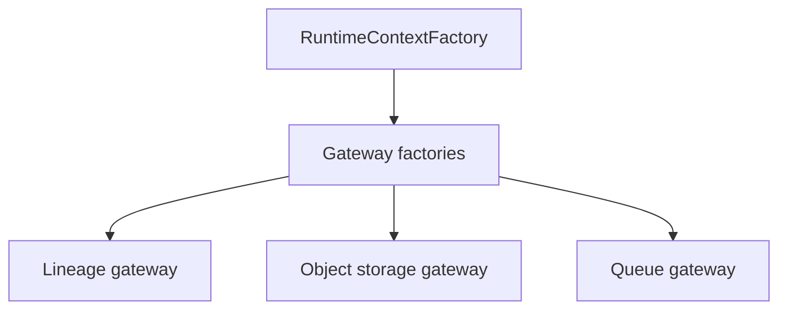
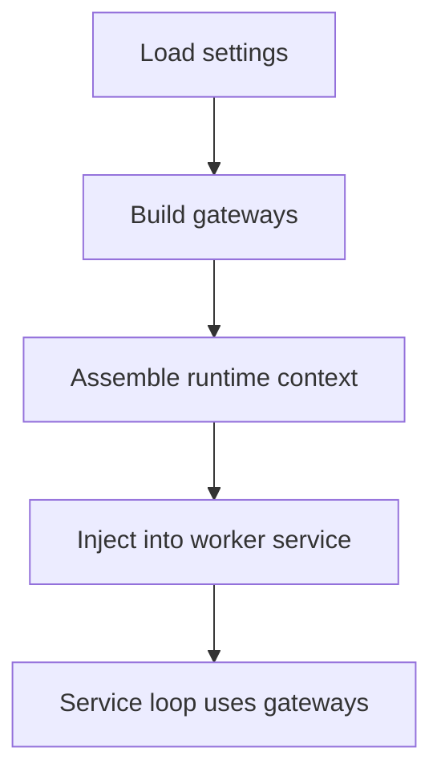

# 1. Purpose

This file provides docs-path architecture for pipeline_common.gateways.

Scope:
- runtime adapters for lineage, object storage, queue, and counters.

# 2. High-Level Responsibilities

- Expose worker-facing infrastructure adapters.
- Centralize gateway construction through factories.

# 3. Architectural Overview

- factories create configured adapters.
- startup runtime factory injects adapters into worker services.

# 4. Module Structure

- ../factories
- ../lineage
- ../object_storage
- ../queue
- ../observability

# 5. Runtime Flow (Golden Path)

1. startup resolves settings bundle.
2. gateway factories build concrete adapters.
3. adapters are passed in runtime context.
4. worker services use adapters in serve loop.

# 6. Key Abstractions

- DataHubLineageGatewayFactory
- ObjectStorageGatewayFactory
- StageQueueGatewayFactory
- LineageRuntimeGateway
- ObjectStorageGateway
- StageQueue

# 7. Extension Points

- Add new gateway submodule and factory when adding integration surfaces.

# 8. Known Issues & Technical Debt

- Some adapters have startup-time side effects (for example queue connection on init).

# 9. Future Roadmap / Planned Enhancements

Confirmed roadmap:
- None explicitly documented in this module.

# 10. Anti-Patterns / What Not To Do

- Do not bypass gateway abstractions for integrations already modeled by existing gateways.

# 11. Glossary

- Gateway: infrastructure adapter exposing worker-facing operations.
