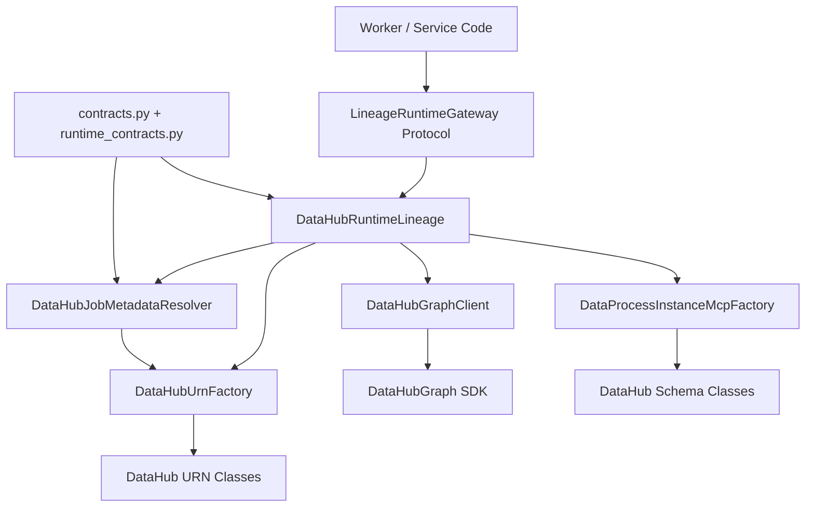
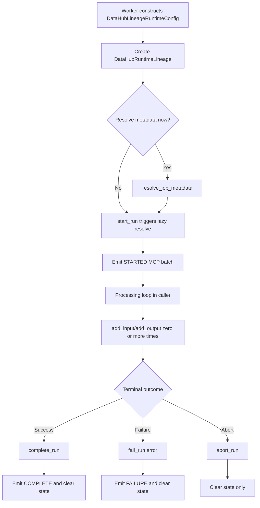

# 1. Purpose

`pipeline_common.gateways.lineage` provides a DataHub-backed runtime lineage gateway for workers.

It exists to solve two runtime needs:
- Resolve stage/job metadata (custom properties) from DataHub `DataJobInfo`.
- Emit run-scoped DataProcessInstance lineage events (start, IO edges, complete/failure).

What it does:
- Reads DataHub metadata for a configured job key.
- Builds DataHub URNs for flow/job/dataset/process-instance entities.
- Tracks one active in-memory run context.
- Emits ordered MCP batches for run lifecycle transitions.
- Best-effort upserts `datasetProperties` for referenced datasets.

What it does not do:
- It does not provide a vendor-neutral lineage model.
- It does not manage worker loops, scheduling, retries, or process lifecycle.
- It does not persist local run state beyond process memory.
- It does not guarantee exactly-once emission semantics.

Boundary in system:
- This package is a gateway/adapter layer consumed by worker code.
- Upstream callers interact through `LineageRuntimeGateway` and runtime dataclasses.
- Downstream dependency is DataHub SDK (`DataHubGraph`, schema classes, URN helpers).

# 2. High-Level Responsibilities

Core responsibilities:
- Model runtime configuration (`DataHubLineageRuntimeConfig`, `DataHubRuntimeConnectionSettings`).
- Resolve DataJob metadata (`DataHubJobMetadataResolver`).
- Build URNs (`DataHubUrnFactory`).
- Build DataProcessInstance MCP aspects in stable order (`DataProcessInstanceMcpFactory`).
- Emit MCPs and read aspects via graph client wrapper (`DataHubGraphClient`).
- Provide run lifecycle API (`DataHubRuntimeLineage`: start/add-input/add-output/complete/fail/abort).

Non-responsibilities:
- No composition-root ownership for full worker bootstrapping.
- No business-specific lineage mapping rules outside generic dataset/job identifiers.
- No cross-process coordination for concurrent run sessions.

Separation of concerns in current design:
- `contracts.py` and `runtime_contracts.py`: typed contracts and value objects.
- `urns.py`: URN generation only.
- `lineage.py`: orchestration + DataHub IO + MCP assembly.
- `settings.py`: env-driven bootstrap settings helper.

# 3. Architectural Overview

Overall design:
- The module implements a pragmatic Ports-and-Adapters shape centered on `LineageRuntimeGateway`.
- `DataHubRuntimeLineage` is the concrete adapter and runtime orchestrator.
- DataHub-specific concerns (SDK IO, schema classes, URNs) are encapsulated in this package, not abstracted away from it.

Layering (within this module):
- Contracts layer: runtime/domain-like dataclasses and protocol.
- Gateway service layer: stateful runtime session orchestration.
- Infrastructure helper layer: graph client wrapper, URN factory, MCP factory.

Patterns used:
- Ports & Adapters:
  - `LineageRuntimeGateway` is the application-facing port.
  - `DataHubRuntimeLineage` is the adapter implementation.
- Dependency Injection:
  - `DataHubRuntimeLineage` accepts optional injected `DataHubGraphClient`.
- Factory/Assembler:
  - `DataProcessInstanceMcpFactory` builds ordered MCP payload batches.
  - `DataHubUrnFactory` centralizes URN construction.
- Stateful Session Object:
  - `DataHubRuntimeLineage` stores one active run context.

Why these patterns were chosen (inferred from code):
- Keep worker call sites small and explicit.
- Centralize DataHub wire-format and schema handling.
- Enable testability through protocol boundary and injectable graph client.
- Preserve deterministic aspect emission order.

# 4. Module Structure

Package layout:
- `contracts.py`: `DatasetPlatform`, `DataHubDataJobKey`, `ResolvedDataHubFlowConfig`.
- `runtime_contracts.py`: runtime dataclasses + `LineageRuntimeGateway` protocol.
- `settings.py`: `DataHubSettings.from_env()`.
- `urns.py`: `DataHubUrnFactory`.
- `lineage.py`: runtime implementation and DataHub adapters.
- `__init__.py`: re-exported public surface.
- `ARCHITECTURE.md`: this document.

What belongs where:
- Add shared typed inputs/outputs to `contracts.py` or `runtime_contracts.py`.
- Add DataHub URN helpers to `urns.py`.
- Add DataHub graph read/write wrappers to `lineage.py` near `DataHubGraphClient`.
- Keep worker-specific composition and app loop code outside this package.

Dependency flow:
- Contracts are imported by runtime implementation.
- Runtime implementation imports URN + DataHub SDK/schema helpers.
- No file in this module depends on worker entrypoint code.

# 5. Runtime Flow (Golden Path)

Assumption:
- Entry point is worker/application code that constructs this gateway. The exact worker composition root is outside this package.

Step-by-step flow:
1. Entry point creates `DataHubLineageRuntimeConfig` (connection settings + data job key).
2. Entry point constructs `DataHubRuntimeLineage(config, graph_client?)`.
3. Caller optionally invokes `resolve_job_metadata()` (otherwise lazy resolution occurs on first use).
4. Caller invokes `start_run()`.
5. Gateway generates run id, initializes `ActiveRunContext`, emits `STARTED` event MCP batch.
6. During processing, caller invokes `add_input()` / `add_output()`.
7. Gateway builds dataset URN, best-effort emits `datasetProperties`, appends URN to run IO lists.
8. Caller invokes `complete_run()` or `fail_run(error_message)`.
9. Gateway emits terminal event MCP batch and clears active run state.
10. Optional `abort_run()` clears state without terminal emission.

Shutdown/termination behavior:
- No explicit shutdown hook exists in this module.
- Graph operations use context-managed `DataHubGraph` operations per call.

# 6. Key Abstractions

`LineageRuntimeGateway` (`runtime_contracts.py`)
- Represents: application-facing runtime lineage port.
- Exists to: define stable API for callers independent of concrete implementation details.
- Depends on: contract types (`RunSpec`, `DatasetPlatform`, `ResolvedDataHubFlowConfig`).
- Depended on by: worker/service code.
- Safe extension: add methods only when needed by multiple callers; keep semantics lifecycle-safe.

`DataHubRuntimeLineage` (`lineage.py`)
- Represents: concrete stateful runtime lineage adapter.
- Exists to: orchestrate run lifecycle and perform DataHub emissions.
- Depends on: runtime config, `DataHubGraphClient`, `DataHubUrnFactory`, `DataProcessInstanceMcpFactory`, `DataHubJobMetadataResolver`.
- Depended on by: callers using `LineageRuntimeGateway`.
- Safe extension:
  - Preserve one-active-run invariant.
  - Keep terminal methods clearing active context.
  - Preserve MCP ordering and URN compatibility.

`DataHubGraphClient` (`lineage.py`)
- Represents: thin DataHub SDK facade for aspect read and MCP write.
- Exists to: isolate SDK calls, error handling, and context-management from orchestrator.
- Depends on: `DataHubGraph`, `DatahubClientConfig`, `requests` exceptions.
- Depended on by: `DataHubJobMetadataResolver`, `DataHubRuntimeLineage`.
- Safe extension: keep methods narrow (`get_datajob_info`, `emit_mcps`), avoid embedding business logic.

`DataHubJobMetadataResolver` (`lineage.py`)
- Represents: resolver for static DataJob metadata used at runtime.
- Exists to: compute input DataJob URN and return typed resolved config.
- Depends on: metadata reader protocol (`get_datajob_info`), URN factory, data job key.
- Depended on by: `DataHubRuntimeLineage.resolve_job_metadata()`.
- Safe extension: keep resolution explicit in `resolve()`, maintain empty-dict fallback on missing metadata.

`DataProcessInstanceMcpFactory` (`lineage.py`)
- Represents: assembler for one status transition’s MCP payload set.
- Exists to: keep payload assembly isolated and ordered.
- Depends on: DataHub schema classes and `RunSpec`.
- Depended on by: `DataHubRuntimeLineage._emit_dpi_event()`.
- Safe extension: append new aspects carefully; avoid reordering existing aspects unless migration is intentional.

`DataHubUrnFactory` (`urns.py`)
- Represents: URN builder utility.
- Exists to: keep URN formats centralized.
- Depends on: DataHub URN classes.
- Depended on by: resolver and runtime lineage adapter.
- Safe extension: add new URN helpers, do not alter existing URN encoding behavior without coordinated migration.

# 7. Extension Points

Where to add new features:
- New lifecycle metadata fields:
  - Extend `CustomProperties` and propagate through `DataProcessInstancePropertiesClass` assembly.
- New emitted lineage aspects:
  - Extend `DataProcessInstanceMcpFactory`.
- New metadata resolution keys:
  - Add typed accessors in `ResolvedDataHubFlowConfig`.

Where new integrations should plug in:
- If a non-DataHub backend is needed, add a new `LineageRuntimeGateway` implementation in a separate module/package.
- Keep this package DataHub-specific unless intentionally generalized.

How to add new workers/services using conventions:
- Construct `DataHubLineageRuntimeConfig` at worker composition root.
- Inject gateway where stage processing occurs.
- Follow call order: start -> add inputs/outputs -> complete/fail.

How to avoid boundary violations:
- Do not move worker business logic into gateway classes.
- Do not expose SDK objects in public contracts; keep return types as primitives/dataclasses.
- Keep env parsing isolated to `settings.py` or composition root.

# 8. Known Issues & Technical Debt

Issue: `DataHubRuntimeLineage` combines orchestration and infrastructure concerns.
- Why problematic: increases class surface area and coupling to DataHub schema details.
- Future direction: split into session/state component + emission adapter if complexity grows.

Issue: Single active run context per instance.
- Why problematic: unsafe for concurrent/multi-run use with shared instance.
- Future direction: document strict per-run/per-worker instance usage or introduce explicit run handles.

Issue: Dataset properties emission cache is process-local (`_dataset_properties_emitted`).
- Why problematic: duplicates can still occur across processes/restarts.
- Future direction: keep idempotent upsert behavior and accept duplicates, or introduce external dedupe when needed.

Issue: Partial error policy asymmetry.
- Why problematic: datasetProperties failures are suppressed, run event failures are raised; callers must understand this contract.
- Future direction: make error policy configurable per operation type if requirements change.

Issue: DataHub naming leaks through many internal types.
- Why problematic: raises migration cost for alternate lineage backends.
- Future direction: introduce vendor-neutral internal contracts only if multi-backend support is a real requirement.

# 9. Future Roadmap / Planned Enhancements

Confirmed roadmap:
- None explicitly encoded in this module’s code or docs at this time.

# 10. Anti-Patterns / What Not To Do

- Do not instantiate `DataHubGraph` directly throughout worker code; use `DataHubGraphClient`/gateway path.
- Do not call `add_input`/`add_output` without `start_run`; this violates lifecycle invariants and raises errors.
- Do not share one `DataHubRuntimeLineage` instance across concurrent runs unless you add synchronization and per-run addressing.
- Do not change MCP aspect ordering casually; downstream expectations may rely on current sequence.
- Do not bypass `DataHubUrnFactory` for equivalent URN types; inconsistent URN formatting will fragment lineage.
- Do not treat suppressed `datasetProperties` failures as successful guarantees; they are best-effort.

# 11. Glossary

- DataHub: metadata platform used as lineage backend.
- MCP: Metadata Change Proposal payload emitted to DataHub.
- DPI: DataProcessInstance, the run-scoped execution entity in DataHub.
- DataJob: template/job definition entity; source for static custom properties.
- RunSpec: in-memory model for one active runtime run (id, properties, inputs, outputs).
- Flow instance: cluster/environment segment used in DataHub flow/job URNs (mapped from configured `env`).
