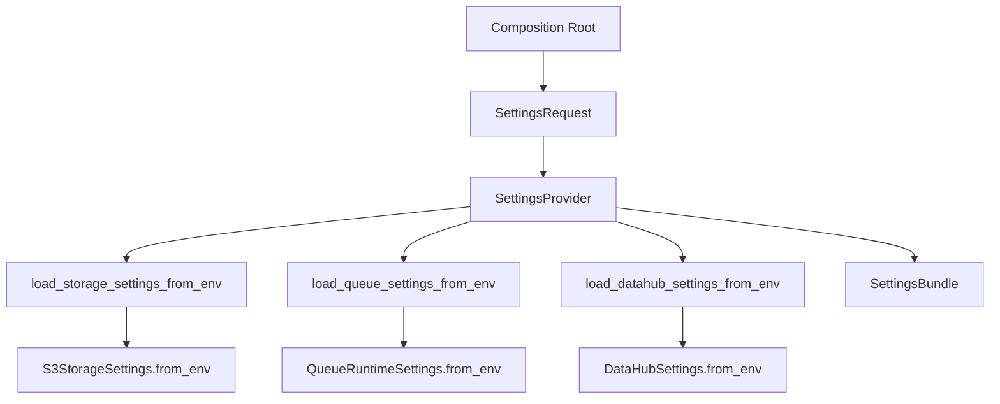
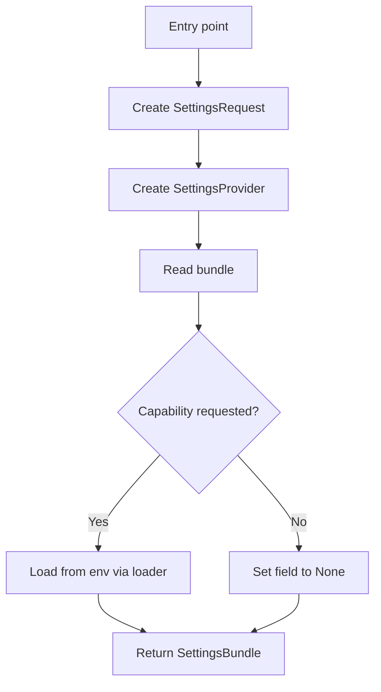

# 1. Purpose

`pipeline_common.settings` provides capability-scoped environment settings loading.

Problem it solves:
- Composition roots need typed runtime settings without embedding env parsing logic.

Why it exists:
- Centralize env-to-typed-settings conversion.
- Let callers request only the settings capabilities they need.

What it does:
- Defines `SettingsRequest` for capability flags.
- Loads selected capability settings (`storage`, `queue`, `datahub`) from env.
- Returns a typed `SettingsBundle` snapshot.

What it does not do:
- It does not wire services/gateways.
- It does not validate cross-capability consistency.
- It does not implement DB/cache loaders yet (`NotImplementedError`).

Boundaries:
- Upstream: worker/app composition roots and startup factory.
- Downstream: gateway-specific settings modules + process environment.

# 2. High-Level Responsibilities

Core responsibilities:
- Expose a typed settings request/bundle contract.
- Convert env variables to concrete settings objects.
- Keep capability loading explicit and opt-in.

Non-responsibilities:
- No dependency graph construction.
- No runtime service ownership.
- No secrets management beyond env reads.

Separation of concerns:
- Request contract: `SettingsRequest`.
- Result contract: `SettingsBundle`.
- Loading logic: free functions + `SettingsProvider` properties.

# 3. Architectural Overview

Overall design:
- Provider-style configuration adapter around capability flags.
- Callers specify capabilities and receive one typed bundle.

Layering:
- Contracts/data layer: request/bundle dataclasses.
- Adapter layer: provider properties and env loader functions.

Patterns used:
- Provider pattern: `SettingsProvider` encapsulates loading behavior.
- Capability gating: per-capability boolean flags in `SettingsRequest`.
- Snapshot DTO: `SettingsBundle` captures a resolved settings view.

Why chosen:
- Keeps composition roots declarative.
- Reduces accidental env dependency spread.
- Supports partial capability needs per process.

# 4. Module Structure

Package layout:
- `provider.py`: all contracts and loading implementation.
- `__init__.py`: package exports.
- `ARCHITECTURE.md`: this document.

What belongs where:
- Add new capability request fields to `SettingsRequest`.
- Add corresponding typed field to `SettingsBundle`.
- Add capability loader function in `provider.py`.
- Keep gateway-specific env details in each gateway settings module.

Dependency flow:
- `SettingsProvider` depends on specific capability loader functions.
- Loader functions delegate to gateway settings classes (`from_env()`).
- Callers depend on `SettingsBundle`, not env variables directly.

# 5. Runtime Flow (Golden Path)

Standard usage:
1. Composition root constructs `SettingsRequest` with needed capabilities.
2. Composition root creates `SettingsProvider(request)`.
3. Composition root reads `provider.bundle`.
4. Provider resolves requested capabilities via property access.
5. Provider returns `SettingsBundle` with requested settings and `None` for unrequested capabilities.
6. Caller passes bundle to runtime/service factories.

Shutdown/termination behavior:
- None. This module performs pure configuration loading and returns data objects.

# 6. Key Abstractions

`SettingsRequest`
- Represents: capability selection contract.
- Why exists: makes configuration dependencies explicit at composition root.
- Depends on: boolean flags only.
- Depended on by: `SettingsProvider` consumers.
- Safe extension: add new optional flags with default `False`.

`SettingsBundle`
- Represents: resolved typed settings snapshot.
- Why exists: transport settings consistently to runtime builders.
- Depends on: typed settings classes.
- Depended on by: startup/runtime composition paths.
- Safe extension: add optional fields without breaking existing callers.

`SettingsProvider`
- Represents: env-backed capability loader facade.
- Why exists: centralize env parsing dispatch.
- Depends on: loader functions and environment.
- Depended on by: entrypoints and startup factory path.
- Safe extension: keep per-capability loading isolated and side-effect free beyond env reads.

Loader functions (`load_*_settings_from_env`)
- Represents: concrete conversion boundary per capability.
- Why exists: decouple provider flow from capability implementations.
- Depends on: gateway settings modules.
- Depended on by: provider properties.
- Safe extension: preserve typed return contracts and explicit error behavior.

# 7. Extension Points

Where to add features:
- New capability support: add request flag, bundle field, loader function, and provider property.
- New validation layer: add optional post-load validator over `SettingsBundle`.

How new integrations should plug in:
- Keep integration-specific env parsing in its own settings module.
- Call it from this provider through a narrow loader function.

How to avoid boundary violations:
- Do not import business services into settings provider.
- Do not inject runtime wiring logic into this package.
- Do not silently auto-enable capabilities not requested.

# 8. Known Issues & Technical Debt

Issue: DB/cache capabilities are declared but unimplemented.
- Why problem: request flags exist but load path raises `NotImplementedError`.
- Direction: either implement loaders or remove/feature-flag capabilities until needed.

Issue: provider properties re-evaluate on each access.
- Why problem: repeated property reads can re-read environment and create repeated objects.
- Direction: add optional memoization if repeated property access becomes common.

Issue: no bundle-level consistency validation.
- Why problem: incompatible/missing combined settings are detected later in startup or runtime.
- Direction: add optional validator layer where cross-capability rules are required.

# 9. Future Roadmap / Planned Enhancements

Confirmed roadmap:
- None explicitly documented in this module.

# 10. Anti-Patterns / What Not To Do

- Do not parse environment variables directly in worker services when this provider can own it.
- Do not treat unrequested settings as guaranteed non-`None`.
- Do not add business defaults unrelated to configuration loading.
- Do not swallow loader exceptions that should fail fast during startup.

# 11. Glossary

- Capability: one settings domain (for example `storage`, `queue`, `datahub`).
- Settings Request: boolean flags indicating which capabilities to load.
- Settings Bundle: typed output containing loaded settings for requested capabilities.
- Loader Function: per-capability env conversion entrypoint.
