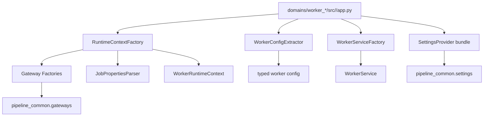
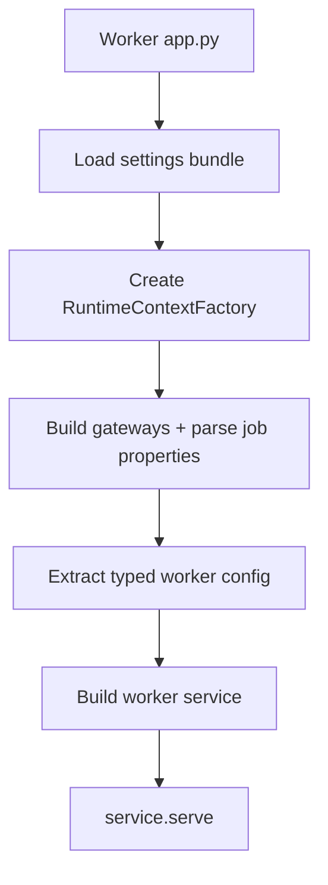

# 1. Purpose

`pipeline_common.startup` standardizes worker bootstrap contracts and runtime assembly.

Problem it solves:
- Every worker needs the same startup sequence: load shared runtime context, extract worker config, build service, start loop.

Why it exists:
- Avoid duplicated composition logic across `domains/worker_*` entrypoints.
- Keep worker `app.py` files thin and consistent.

What it does:
- Defines startup contracts (`WorkerConfigExtractor`, `WorkerServiceFactory`, `WorkerService`).
- Builds `WorkerRuntimeContext` from settings + DataHub job key.
- Parses DataHub custom properties into nested `job_properties`.

What it does not do:
- It does not implement worker business processing.
- It does not own worker-specific config semantics.
- It does not run deployment orchestration or process supervision.

Boundaries:
- Upstream: worker entrypoints under `domains/worker_*/src/<worker_package>/app.py`.
- Downstream: `pipeline_common.settings` and `pipeline_common.gateways`.

# 2. High-Level Responsibilities

Core responsibilities:
- Provide shared startup abstractions for worker extensibility.
- Construct runtime dependencies used by all workers.
- Support a consistent worker bootstrap shape.

Non-responsibilities:
- No domain processing logic.
- No persistent runtime state management.
- No retry/backoff orchestration beyond what services/gateways do.

Separation of concerns:
- `contracts.py`: startup extension interfaces.
- `runtime_context.py`: immutable runtime dependency bundle.
- `runtime_factory.py`: runtime context assembly.
- `job_properties.py`: dot-key to nested dict parser.

# 3. Architectural Overview

Overall design:
- This package is a startup support layer with explicit extension points.
- Worker domains supply implementations of extractor and service factory.
- Shared startup code builds infra dependencies once and passes them forward.

Layering in this package:
- Contracts layer: generic worker startup interfaces.
- Composition layer: runtime context factory.

Patterns used:
- Composition Root support: workers use this package to compose runtime services.
- Dependency Injection: workers inject runtime context into extractor and service factory flows.
- Factory pattern: `RuntimeContextFactory` and worker service factories build objects.

Why chosen:
- Constrains worker startup drift through shared contracts.
- Preserves flexibility for worker-specific config/service graphs.
- Keeps startup mechanics reusable across multiple workers.

# 4. Module Structure

Package layout:
- `contracts.py`: startup contracts and polling contract dataclass.
- `runtime_context.py`: `WorkerRuntimeContext` dataclass.
- `runtime_factory.py`: `RuntimeContextFactory`.
- `job_properties.py`: `JobPropertiesParser`.
- `__init__.py`: package exports.

What belongs where:
- Add new shared startup contract types in `contracts.py`.
- Add runtime dependency fields in `runtime_context.py`.
- Add cross-worker bootstrap assembly in `runtime_factory.py`.
- Keep worker-specific parsing/building in worker domain `startup/` folders.

Dependency flow:
- `runtime_factory` depends on gateway factories, settings bundle, and job-properties parser.
- Worker domains depend on this package; this package does not depend on worker domains.

# 5. Runtime Flow (Golden Path)

Standard startup path used by worker entrypoints:
1. Worker entrypoint creates `SettingsProvider(SettingsRequest(...)).bundle`.
2. Worker builds `RuntimeContextFactory(data_job_key, settings_bundle)`.
3. Runtime factory builds lineage gateway, resolves job metadata, parses custom properties, builds storage/queue gateways.
4. Worker entrypoint calls extractor to build typed worker config.
5. Worker entrypoint calls service factory to construct worker service.
6. Worker entrypoint invokes `service.serve()` and transfers control to worker loop.

Shutdown/termination behavior:
- Service lifecycle termination is owned by worker service implementation.

# 6. Key Abstractions

`WorkerConfigExtractor[T]`
- Represents: worker-specific config parser contract.
- Why exists: keeps worker-specific config parsing out of shared startup orchestration.
- Depends on: resolved `job_properties` mapping.
- Depended on by: worker entrypoints.
- Safe extension: keep extraction deterministic and validation-focused.

`WorkerServiceFactory[TConfig, TService]`
- Represents: worker-specific service construction contract.
- Why exists: isolate dependency graph creation per worker.
- Depends on: `WorkerRuntimeContext`, typed worker config.
- Depended on by: worker entrypoints.
- Safe extension: avoid side effects unless explicitly required (for example schema/bootstrap checks).

`WorkerService`
- Represents: long-running worker loop contract (`serve()`).
- Why exists: workers expose a consistent runtime boundary.
- Depends on: concrete service internals.
- Depended on by: worker entrypoint path.
- Safe extension: keep `serve()` blocking and lifecycle-owned by service implementation, without embedding stage-payload or app/query contract helpers.

`RuntimeContextFactory`
- Represents: shared runtime dependency assembler.
- Why exists: one place to build lineage/storage/queue/optional Elasticsearch gateways, and parsed job properties.
- Depends on: settings bundle, data job key, gateway factories.
- Depended on by: worker entrypoints.
- Safe extension: preserve returned `WorkerRuntimeContext` contract and keep additions capability-driven rather than worker-specific.

# 7. Extension Points

Where to add features:
- New shared startup contract: `contracts.py`.
- New shared runtime dependency: `runtime_context.py` + `runtime_factory.py`.
- New worker config logic: worker-local `startup/config_extractor.py`.
- New worker service graph: worker-local `startup/service_factory.py`.

How to add a new worker following conventions:
1. Create worker `src/<worker_package>/app.py` composition root.
2. Request needed settings via `SettingsRequest`.
3. Build `RuntimeContextFactory` with job key from registry.
4. Implement worker extractor + service factory.
5. Extract config, build the service, and call `serve()`.

Boundary guardrails:
- Do not import worker-specific modules into `pipeline_common.startup`.
- Do not embed worker business logic in runtime factory.
- Keep startup package generic and reusable.

# 8. Known Issues & Technical Debt

Issue: `RuntimeContextFactory.__init__` performs full runtime assembly.
- Why problem: object construction has side effects (metadata resolution and gateway initialization).
- Direction: consider explicit `.build()` method to separate construction from execution.

Issue: `JobPropertiesParser` only expands dotted keys.
- Why problem: non-dotted custom properties are ignored by parser output.
- Direction: document this contract clearly or support explicit passthrough map for flat keys.

Issue: implicit required nested keys in runtime factory.
- Why problem: `job_properties["job"]["queue"]` can fail if metadata contract is missing/incomplete.
- Direction: add explicit validation and clearer startup errors near parser/factory boundary.

# 9. Future Roadmap / Planned Enhancements

Confirmed roadmap:
- None explicitly documented in this module.

# 10. Anti-Patterns / What Not To Do

- Do not place worker business processing logic in `pipeline_common.startup`.
- Do not couple shared startup contracts to specific worker types.
- Do not mutate `WorkerRuntimeContext` after build; treat it as immutable runtime input.
- Do not assume all custom properties are present without validation.

# 11. Glossary

- Worker Runtime Context: shared dependencies injected into worker services.
- Config Extractor: worker-specific parser from generic job properties to typed config.
- Service Factory: worker-specific constructor for the concrete worker service.
- Job Properties: nested config derived from DataHub `custom_properties` dot-notation keys.
