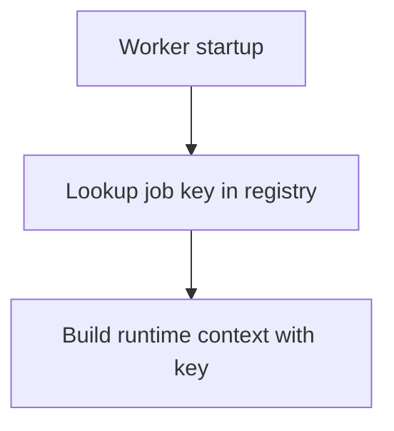

# 1. Purpose

registry provides runtime DataHub job key lookup for worker composition roots.

# 2. High-Level Responsibilities

- Hold static pipeline/job mappings.
- Return typed DataHubDataJobKey values.

# 3. Architectural Overview

- datahub_job_key_registry.py contains enum-backed mapping.
- __init__.py re-exports public API.

# 4. Module Structure

- __init__.py
- datahub_job_key_registry.py

```mermaid
graph TD
    A[Worker app.py] --> B[DataHubPipelineJobs.job(job_id)]
    B --> C[DataHubDataJobKey]
    C --> D[RuntimeContextFactory]
```

# 5. Runtime Flow (Golden Path)

1. Worker selects pipeline enum member.
2. Worker requests job key by worker id.
3. Registry returns typed key consumed by startup runtime factory.



# 6. Key Abstractions

- DataHubPipelineJobs
- DataHubDataJobKey

# 7. Extension Points

- Add/update worker mappings in enum value map.

# 8. Known Issues & Technical Debt

- Manual sync needed with governance definition source-of-truth.

# 9. Future Roadmap / Planned Enhancements

Confirmed roadmap:
- None explicitly documented in this module.

# 10. Anti-Patterns / What Not To Do

- Do not hardcode worker job key tuples in entrypoints when registry mapping exists.

# 11. Glossary

- Job key: flow_id, job_id, and flow_platform tuple for runtime lineage bootstrap.
