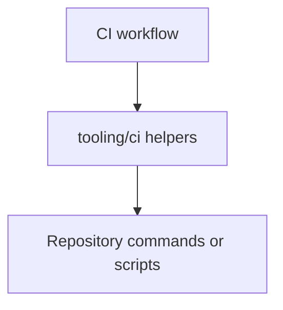
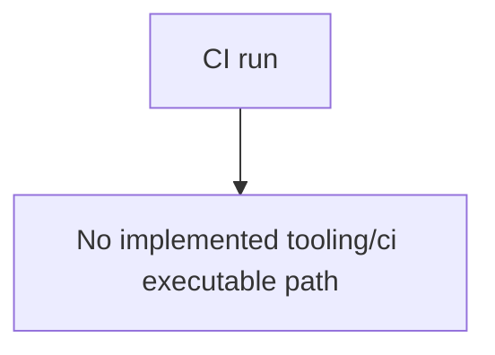

# 1. Purpose

tooling/ci is a reserved location for CI helper tooling.

Current scope:
- README placeholder only.

# 2. High-Level Responsibilities

- Host CI helper scripts when introduced.

# 3. Architectural Overview

No executable CI helper scripts are currently implemented in this folder.

# 4. Module Structure

- README.md
- docs/ARCHITECTURE.md

# 5. Runtime Flow (Golden Path)

Current state:
1. No runtime execution path from this folder yet.

# 6. Key Abstractions

- None implemented yet.

# 7. Extension Points

- Add reusable CI scripts to this folder as workflows evolve.

# 8. Known Issues & Technical Debt

- Placeholder-only module at present.

# 9. Future Roadmap / Planned Enhancements

Confirmed roadmap:
- Add CI helpers to run unit tests, functional tests, and linting consistently across domains/libs.

# 10. Anti-Patterns / What Not To Do

- Do not place production runtime application code here.

# 11. Glossary

- CI helper: script used by automated repository workflows.
