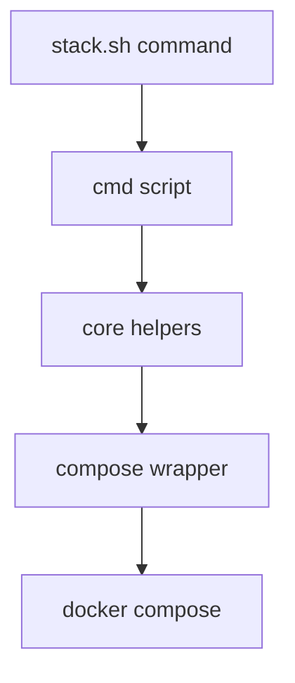
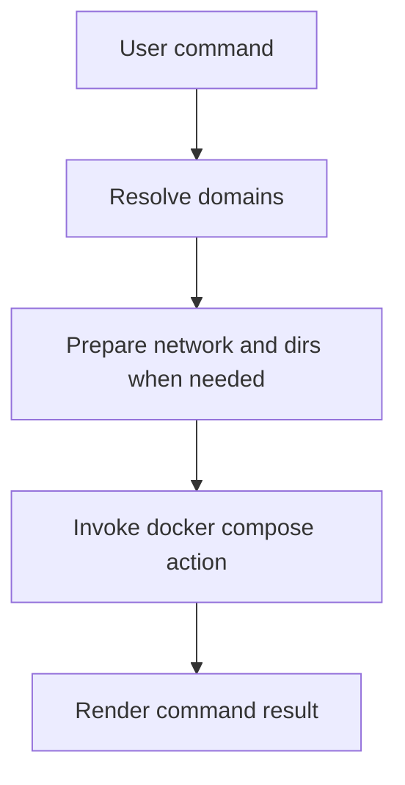

# 1. Purpose

tooling/ops contains shell tooling behind stack.sh for local stack operations.

It provides domain-scoped docker-compose lifecycle commands.

# 2. High-Level Responsibilities

- Start/stop/inspect/log/wipe selected domains.
- Ensure shared local network/data prerequisites.
- Standardize compose invocation conventions.

# 3. Architectural Overview

- cmd/*: user-facing commands.
- lib/core.sh: domain list, output helpers, selection logic.
- lib/compose.sh: compose wrapper.
- lib/network.sh: shared docker network ensure.

# 4. Module Structure

- cmd/up.sh
- cmd/down.sh
- cmd/ps.sh
- cmd/logs.sh
- cmd/wipe.sh
- lib/core.sh
- lib/compose.sh
- lib/network.sh

# 5. Runtime Flow (Golden Path)

1. User invokes stack.sh with command and optional domain.
2. Command validates/expands selected domains.
3. Command routes through compose wrapper.
4. Docker compose runs action per selected domain.

# 6. Key Abstractions

- selected_domains
- compose_domain
- ui_print and section helpers

# 7. Extension Points

- Add operations in cmd/.
- Add reusable shell helpers in lib/.

# 8. Known Issues & Technical Debt

- Bash-only implementation assumptions.
- Output is human-oriented, not fully machine-oriented.

# 9. Future Roadmap / Planned Enhancements

Confirmed roadmap:
- None explicitly documented in this module.

# 10. Anti-Patterns / What Not To Do

- Do not duplicate domain list logic outside lib/core.sh.
- Do not bypass compose wrapper in new commands.

# 11. Glossary

- Domain: one compose package under domains/<name>.
