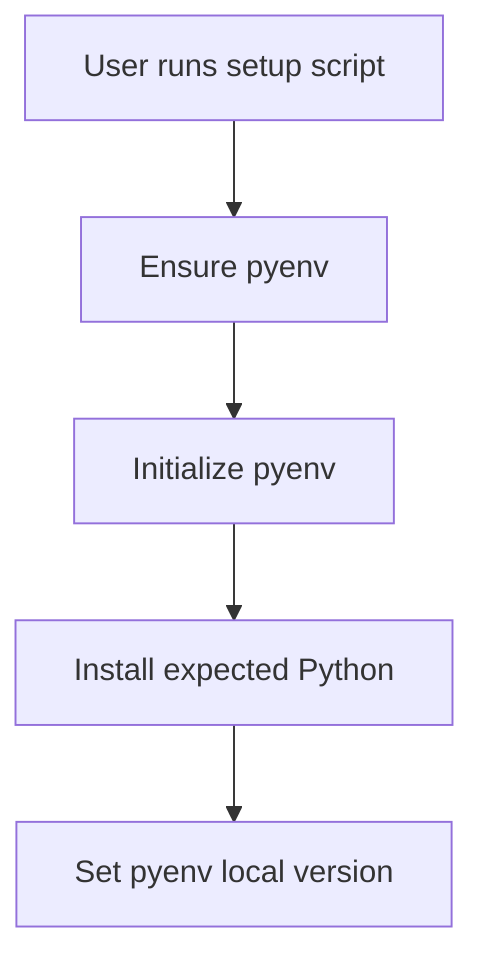
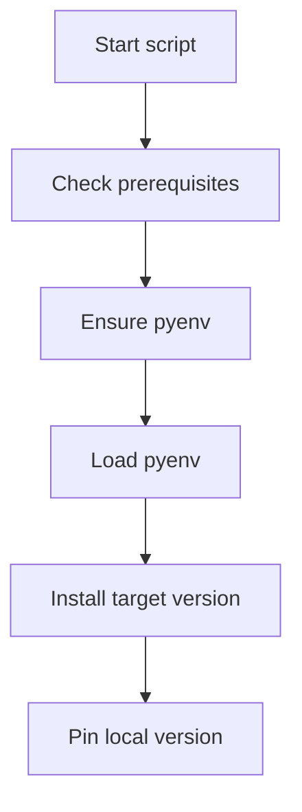

# 1. Purpose

tooling/python_env provides local Python bootstrap for repository development.

# 2. High-Level Responsibilities

- Ensure pyenv availability.
- Install expected Python version.
- Pin local .python-version for repository.
- Optionally add shell init hooks.

# 3. Architectural Overview

Single orchestrator script with staged helper functions for prerequisite checks, pyenv setup, version install, and local pinning.

# 4. Module Structure

- setup-pyenv-local-python.sh

# 5. Runtime Flow (Golden Path)

1. Print current python resolution.
2. Ensure pyenv is installed and available.
3. Initialize pyenv for current shell process.
4. Install target Python if missing.
5. Set repository-local python version.

# 6. Key Abstractions

- ensure_pyenv
- load_pyenv_for_current_shell
- install_python_version
- set_local_version

# 7. Extension Points

- Add additional bootstrap steps as separate helper functions.

# 8. Known Issues & Technical Debt

- Relies on system-level build dependencies for CPython compilation.

# 9. Future Roadmap / Planned Enhancements

Confirmed roadmap:
- None explicitly documented in this module.

# 10. Anti-Patterns / What Not To Do

- Do not force shell RC modifications unless explicitly requested.

# 11. Glossary

- pyenv local: repository-scoped Python version pinning.
